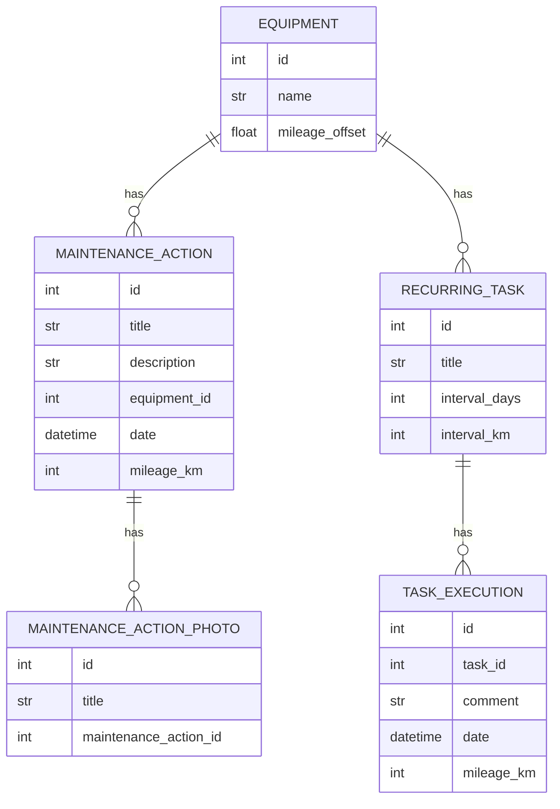

# Bike Maintenance Tracker

(This feature doesn't exist yet, we're [working backwards](https://workingbackwards.com/concepts/working-backwards-pr-faq-process/) from the documentation to the implementation.)

Besides tracking your activities, you can also track maintenance on your bikes.

## Data model

There are maintenance trackers tailored for professional athletes, like [ProBikeGarage](https://www.probikegarage.com/). The intention here is to have something for people who take care of their bikes themselves and think of it as a whole bike and not a set of components that get switched between bikes. If in the future there is demand for component tracking, we can of course think of adding it.

In the current state, we have these entities:

- **Equipment**: A bike, a pair of running shoes. Each *activity* can be associated with exactly one _equipment_. The equipment's mileage (cumulative distance traveled) is computed as the sum of all activities associated with the _equipment_, plus a manual offset from non-tracked activities.
- **Maintenance Action**: A deliberately broad action that was done on the _equipment_. It has a title and is associated with a date, a mileage, a cost and optionally a photo.
- **Recurring Task**: A task is something that needs to be checked or done on a specific _equipment_, but isn't a _maintenance action_ in itself. These are things like “apply chain lube”, “check tire pressure”. Each _task_ has a title, an interval in days and/or an interval in kilometers.
- **Task Execution**: When a _task_ is executed, it is logged with the date and the mileage of the _equipment_ when it was executed.

## Analysis features

For each equipment, you can see the maintenance actions and task executions as well as the pending task executions.

You can see the cost of maintenance, also grouped by equipment and grouped by year.