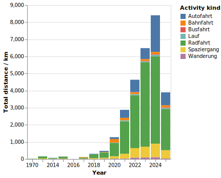
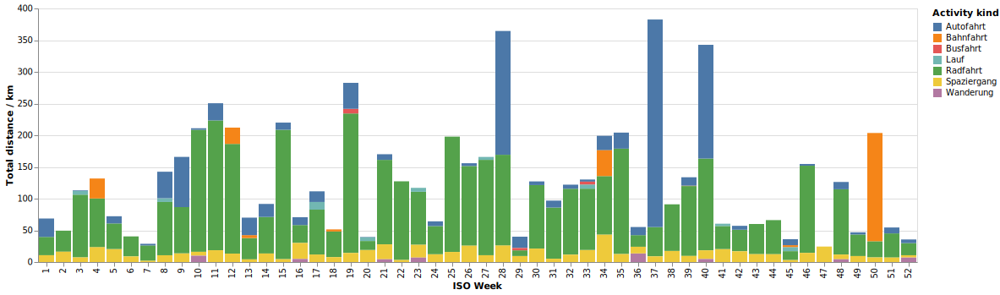
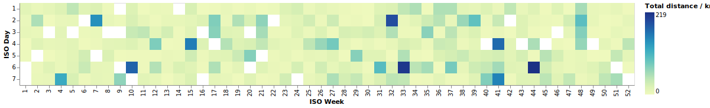

# Build Custom Plots

Activity data can be visualized in lots of ways. Every user want to have slightly different visualizations. Hence since version 0.40.0 you can define your own plots using the interactive plot builder.

Using the JSON codes one can share plots with other users. You can import them in the plot builder. Go to “Admin” → “Plot Builder” and click on “Import”. Paste the code snippet and it will import the plot specification and generate the same from your data.

## Example gallery

To get you started, here is some inspiration with plots that are possible.

---

This one shows the total distance per year as a bar chart, colored by activity kind:



```json
{"name": "Yearly Distance per Kind", "mark": "bar", "x": "year(start):O", "y": "sum(distance_km)", "color": "kind"}
```

---

This one shows the weekly distances as the size of circles. There you can see the usage of ISO year and ISO week.


```json
{"name": "Distance per Week", "mark": "circle", "x": "week:O", "y": "iso_year:O", "size": "sum(distance_km)"}
```

---

Here we have the distances aggregated per week and colored by kind. This plot is grouped by year, so you get some tabs above it and one plot per year:




```json
{"name": "Weekly Distance per Kind", "mark": "bar", "x": "week:O", "y": "sum(distance_km)", "color": "kind", "group_by": "iso_year"}
```

---

You can also create heatmaps, here is the daily distance shown as a calendar spanned by month and day-of-month. One plot per year, here showing one of them.


```json
{"name": "Daily Distance Heatmap", "mark": "rect", "x": "date(start)", "y": "month(start)", "color": "sum(distance_km)", "group_by": "year"}
```

---

Want to spot a pattern in your week? Which days are you most active in? Create a heatmap with the weeks and weekdays separated and you can see which days are with the most distance:



```json
{"name": "Daily distance per weekday", "mark": "rect", "x": "week:O", "y": "iso_day:O", "color": "sum(distance_km)", "group_by": "iso_year"}
```

---

We don't need to use time as one axis. We can also plot the distance versus the elapsed time and visualize activity kind as color. One can see the different typical lengths of activities and their distances. Bike rides (green) clearly stand aside from walks and hikes (yellow and purple). But train and car rides (orange and blue) have a different slope again.


```json
{"name": "My New Plot", "mark": "circle", "x": "hours", "y": "distance_km", "color": "kind"}
```