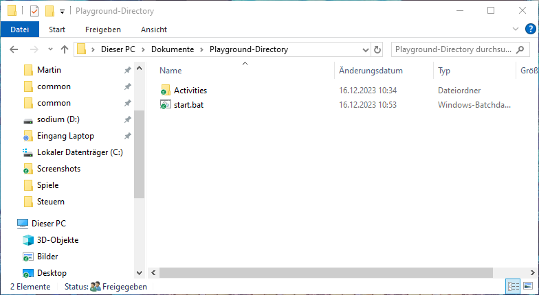

# Create a base directory

Geo Activity Playground lets you explicitly choose where you want to have your files.

Just create a directory somewhere in your user directory. It can be on your desktop, it can be in Google Drive or Dropbox.

## Finding the path for Linux

On Linux you will need to figure out the path of your base directory. This might work by pressing <kbd>CTRL</kbd>+<kbd>L</kbd> and then copying the path out of the address bar. For me it is `/home/mu/Dokumente/Karten/Playground/`, yours might look similar.

## Add a launcher script for Windows

On Windows you can add a launcher script into your base directory such that you can start the program without having to meddle with the command line.

Right-click into the base directory and in the context menu select “Create New” and then “Text File”. Name it `start.bat`. Windows will ask you whether want to change the suffix (file extension) because it might get unusable. Yes, we want to do that. It should look like this:



Then right-click on that file and select “Edit”. A text editor will open up. Put the following content into this file:

```bat
python -m geo_activity_playground serve
pause
```

Then save and close it. I need you to create this file yourself and cannot offer a download because the Windows Defender will not allow you to execute such script files downloaded as a security precaution. If you create the file yourself, it will let you execute it.

Once you have the `start.bat` there, you can double-click on it to execute it. A new terminal window should open and it should start to parse your activities.


After it has loaded everything, you can open <http://127.0.0.1:5000/> in your browser.