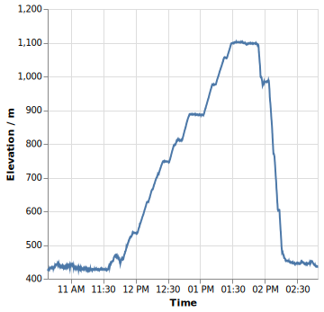
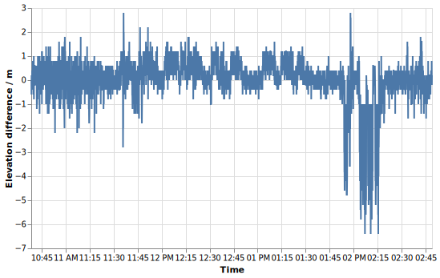
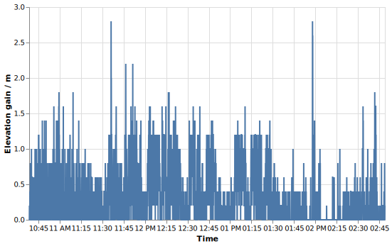
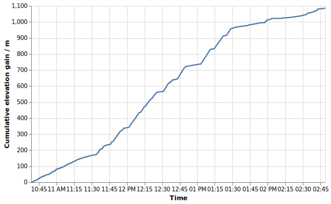
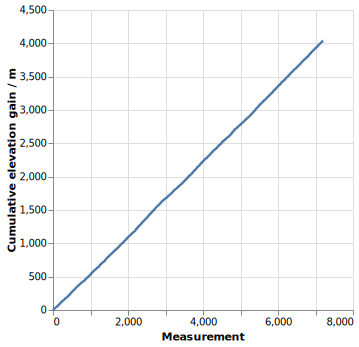
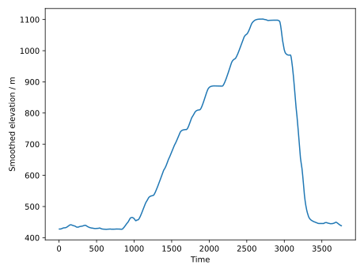
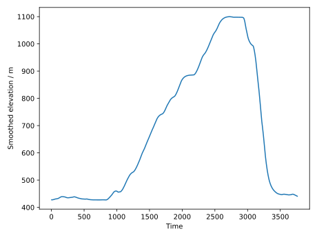
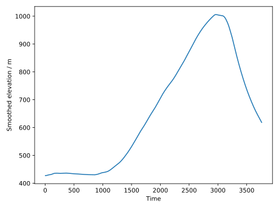
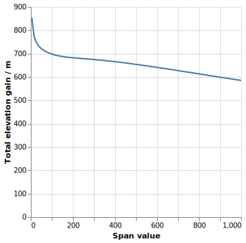

# Elevation Gain from Noisy Data

Here I want to demonstrate why computing altitude gain from GPS data is notoriously hard. You will learn how noisy data leads to inflated values. This is meant as an explanation why the elevation data shown has little merit unless you have a very good recording device.

## Example with bad data

This is an mountain bike activity that I recorded with a Garmin Venu Sq that does _not_ have a barometric altitude sensor but just the GPS.

You can see that the tour started at 450 m, went to 650 m, down to 350 m, back up to 660 m, down to 570 m, up to 670 m, back down to 500 m. So if one wants to gets a rough estimate on the elevation gain, that would be 200 m + 310 m + 100 m = 610 m at least.

How do we now compute that from the data? One can take the difference in elevation between subsequent points and plot that. There are huge spikes, so I have filtered out any points that suggest a change of 30 m altitude in 5 s.

In this image we can already see that there are constantly changes in the elevation in order of ±1 m. This is the lacking accuracy of the GPS devices which has lots of jitter. Compare this plot with the first one: Can you see the big ascension? Can you see the downhill ride at the end? No, it gets lost in the noise!

For the elevation _gain_ we only want to count when the elevation has increased. So we remove the negative differences and only keep the differences. Then the plot looks like this:

In the next step we do the _cumulative sum_ of all these little elevation gains and plot those. With a lot of imagination one can see the ascension in the middle part.

But in the range from 10:45 to 11:30, where I was riding in a flat section, there is a constant increase in elevation gain, giving me almost 200 m at the end. This is the accumulation of noise.

You can see that this ends up being 1,600 m. The rough estimation said that 610 m is a reasonable number if we only count coarse elevation gain. But here we count microscopic elevation gain.

## Simulation with pure noise

The problem really is the noise. We can show how bad it is by just generating a bunch of random measurements and see how this would fare in this analysis. I am generating data points assuming that my GPS has a standard deviation of 1 m, which seems unreasonably accurate. I generate points every 5 seconds for a two hour trip, so that's about 7200 points. But in this experiment, there is no change in the elevation whatsoever.

You can see that although we're just adding up noise, we have around 4,000 m of elevation gain computed by this method.

So unless we can remove the noise from the GPS data, we're doomed to compute a completely inflated elevation gain number.

## Exponential moving average smoothing

We need some way of smoothing the data, ideally one which is “causal”, i.e. only forward looking. An exponential moving average would do the trick.

If we do that, we will smooth out _some_ of the measurement error. But even with a lot of smoothing, there is still noise left. In this experiment the real altitude is always 0, we only see the GPS noise.

You can see that now it is much smoother, fluctuating only between -0.4 and +0.4 m.

From this we can compute the cumulative elevation gain as well. But we still acumulate 120 m of fake elevation gain over these two hours.

### Applying smoothing to the mountain bike tour

We can see how it looks like for the mountain bike tour:

This was smoothed with `span=50`, so it has used like 50 previous measurements to smooth it out. But is that a good value? Should we perhaps use `span=100`? If we do that, it then looks like this:

If we use `span=1000`, then it clearly is too much smoothing:

So what is a good value? We can go through various `span` values and see how much smoothing gets how much altitude gain. We can then see that depending on the span value, we get a different total elevation gain on the mountain bike trip:

And here we see that without smoothing there is around 1,400 m of altitude gain. But that feels too much. Increasing the smoothing we end up at around 610 m as estimated in the beginning. Likely it should be a bit more. Increasing the smoothing will eventually smooth out all the mountains, such that this curve will eventually converge to 0. Which is clearly wrong as well.

We would need to pick some value which feels somewhat right. But it would not be as objective as distance or time would be. By choosing the `span` value one can determine how much elevation gain there is. The value also depends on the measurement device which one has used, which is an absurd dependency.

## Conclusion

Strava very likely uses the actual elevation data from maps to correct this. This is the superior method because elevation data is very noisy by default. But in Geo Activity Playground we don't have the actual map at this point and hence we cannot do this.

Elevation gain data is displayed, but unless you have a very accurate recording device.