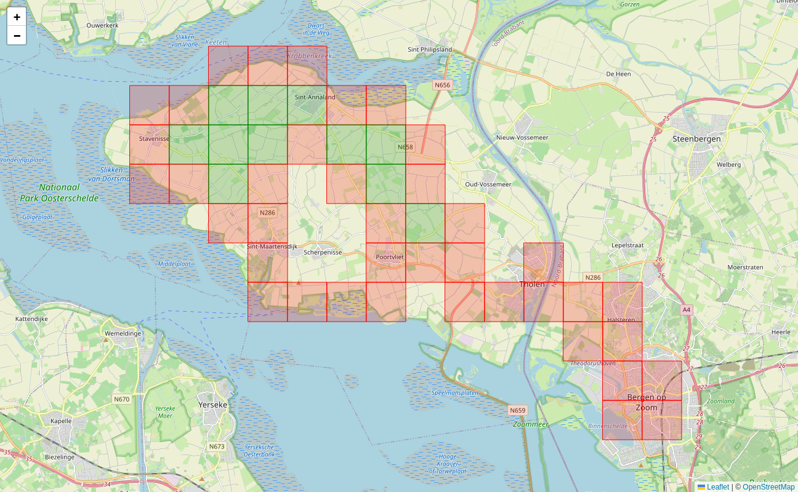
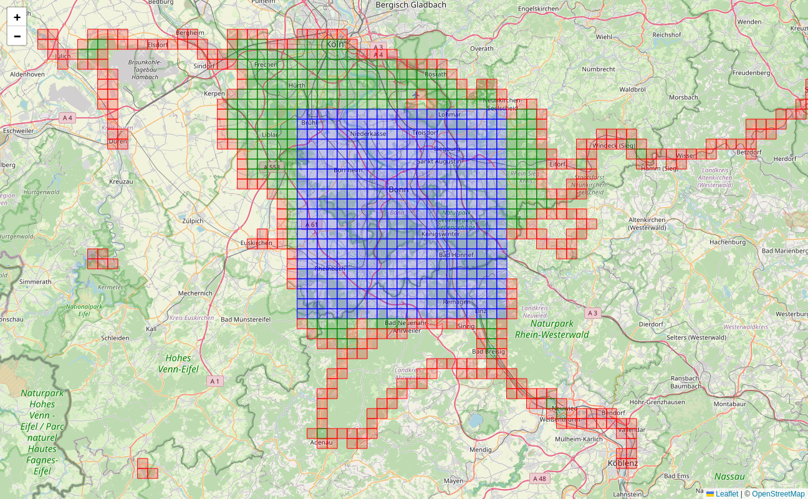

# Explorer Tiles

Maps accessible via the web browser are usually served as little image tiles. The Open Street Map uses the _Web Mercator_ coordinate system to map from latitude and longitude to pixels on the map.

Each tile is 256×256 pixels in size. The zoom levels zoom in by a factor of two. Therefore all the tiles are organized in a _quad tree_. As you zoom in, each tile gets split into four tiles which can then show more detail. The following prescription maps from latitude and longitude (given in degrees) to tile indices:

```python
def compute_tile(lat: float, lon: float, zoom: int = 14) -> tuple[int, int]:
    x = np.radians(lon)
    y = np.arcsinh(np.tan(np.radians(lat)))
    x = (1 + x / np.pi) / 2
    y = (1 - y / np.pi) / 2
    n = 2**zoom
    return int(x * n), int(y * n)
```

At zoom level 14 the tiles have a side length of roughly 1.5 km in Germany. These tiles are used as the basis for _explorer tiles_. The basic idea is that every tile where you have at least one point in an activity is considered an _explored tile_.

From your activities the program will extract all the tiles that you have visited. And then it does a few things with those. One main thing is that it will display these on an interactive map. When we zoom into one area where I've been on vacation in 2023, you can see the explored tiles there:


The colored tiles are explored, I have been there. The green tiles are _cluster tiles_, that means that all their four neighbor tiles are also explored.

You can see here how I have explored a region and ensured that it is mostly contiguous.

There is another vacation from 2013 where I wasn't aware of the cluster tiles. I just did some bike trips and didn't look out for the tiles. There the tiles look like this:



You see all these gaps in there. And this is what the explorer tiles are about: This OCD (obsessive compulsive disorder) like craving to fill in the gaps.

Let's take a look at my main cluster of explorer tiles. Here I have explored much more than in the areas where I was on vacation.



You can see an additional feature, the blue square. This is the one largest square which can be fit into all explored tiles. In this picture it has size 21². The idea of the square is to have a really tough challenge. Not only does one need to explore increasingly many tiles to expand the square by one unit, there must not be any gaps.

As you can see in this picture, there is a tile missing right at the top edge. I will never be able to get that because that is an off-limits area of the German air force at the airport. So I can expand my square to the south only.