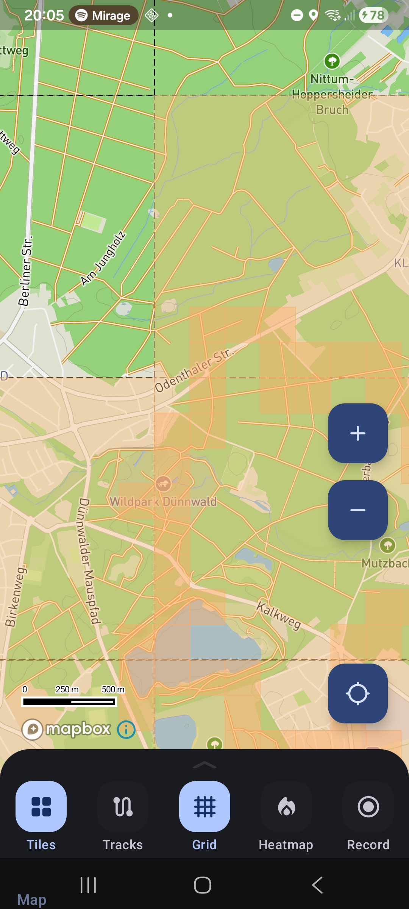
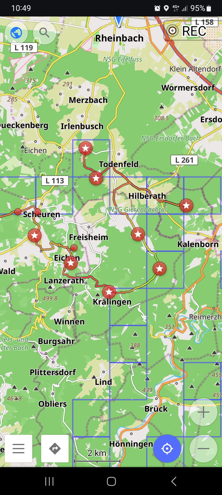
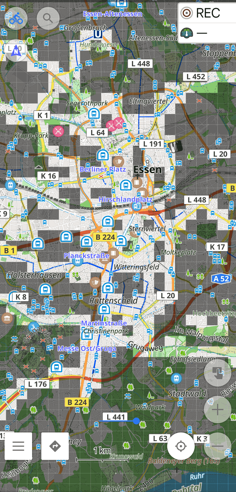
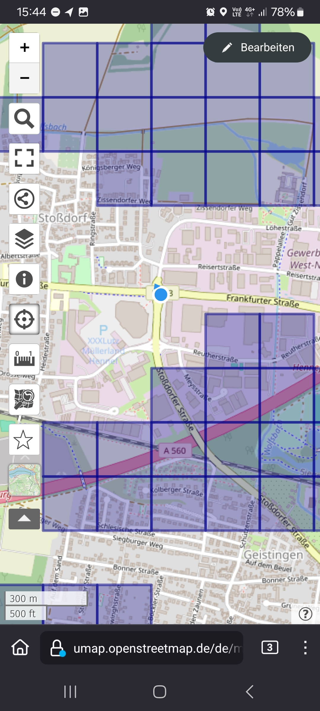

# Explorer Tiles on the Go

Once you know which tiles you have explored and which are still missing, you likely want to take that information with you. This how-to guide collects the ways to get your explored or missing tiles onto a phone or a Garmin device, so you can do spontaneous tile hunting without planning a full route first.

The downloads live below the explorer map. Pan and zoom to the area you care about, then pick the format that the target app understands.

## Explorer Tile Helper

The most convenient option is the [Explorer Tile Helper](https://play.google.com/store/apps/details?id=ru.anisart.vv) app. Below the visible-area downloads there is a link to export _all_ explored tiles as a Squadrats-compatible KML. Unlike the per-area downloads, this covers your whole history. The file follows the structure that [Squadrats](https://squadrats.com/) uses and contains four placemarks: the explored tiles at zoom 14 (_squadrats_) and zoom 17 (_squadratinhos_), plus the largest square at each zoom level (_ubersquadrat_ and _ubersquadratinho_).

Import this file into the app. Layers without data are omitted, so if zoom 17 is not enabled, only the zoom 14 placemarks are written.

This is how that looks in the app:

## OsmAnd

On Android you can use the [OsmAnd](https://osmand.net/) app to display tracks and visualize the missing tiles. Unfortunately [GeoJSON is not supported](https://osmand.net/docs/technical/osmand-file-formats/). But you can export the missing tiles as a GPX file which contains one track per missing tile. Then you can import the GPX file in OsmAnd. This looks strange, but it works for a small region. For bigger regions OsmAnd becomes very sluggish.

Alternatively you can import the missing tiles map layer as online overlay map. For on-the-go you might want a VPN connection like [Using Docker Compose with Tailscale VPN](using-docker-compose-and-tailscale-vpn.md) or use the map tile caching function of OsmAnd in your local network. You need to activate the 'Online maps' plugin. Add a new map online source under `Maps & Resources > Local > Map sources`. Use one of the [Explorer Tiles Tile URLs](using-maps-as-overlays.md) as URL and choose an expiry time, so OsmAnd pulls the newest state after a while. You can `Clear all tiles` to force an update of the map. To add the overlay to your map, `Configure map > Overlay map` and choose your new map source.

## Organic Maps and CoMaps

[Organic Maps](https://organicmaps.app/), or the community fork [CoMaps](https://www.comaps.app/), are FOSS apps that can display offline maps and missing-tile GPX files on Android or iOS devices.

## uMap

You can also use OpenStreetMap uMap, either the instance hosted in [Germany](https://umap.openstreetmap.de/) or [France](https://umap.openstreetmap.fr/). Create a new personal map (consider limiting the access rights, the default is public) and upload the GeoJSON file. You can then use that map on your phone to see your position alongside the missing tiles:

## Offline Maps

Another option is [Offline Maps](https://play.google.com/store/apps/details?id=net.psyberia.offlinemaps). It can display GeoJSON on Android, though you need to buy the add-on for about 5 EUR.

## Garmin device

The explored and missing tiles in the visible area are also available as KML, which is convenient if you want to turn the missing tiles into a map overlay for a Garmin cycling computer.

To get a tile-grid overlay onto a Garmin Edge you need a Garmin map file (`.img`). There is no pure-Python way to write that format, so the conversion is done with [`mkgmap`](https://www.mkgmap.org.uk/), a Java command-line tool. The general workflow is described in [this tutorial](https://peatfaerie.medium.com/how-to-create-a-tile-grid-overlay-for-the-garmin-edge-based-on-veloviewer-unexplored-tiles-5b36e7c401bd): download the missing tiles as KML, convert them, and build the Garmin map.

If `mkgmap` is installed on the machine running this application, the download row additionally offers **Missing as Garmin map** and **Explored as Garmin map**. These run `mkgmap` for you and hand back a ready `gmapsupp.img`. Copy that file into the `Garmin` folder on your device, and the tile grid shows up as a map overlay. The Garmin links are hidden when `mkgmap` is not found, so a default installation is not affected.
