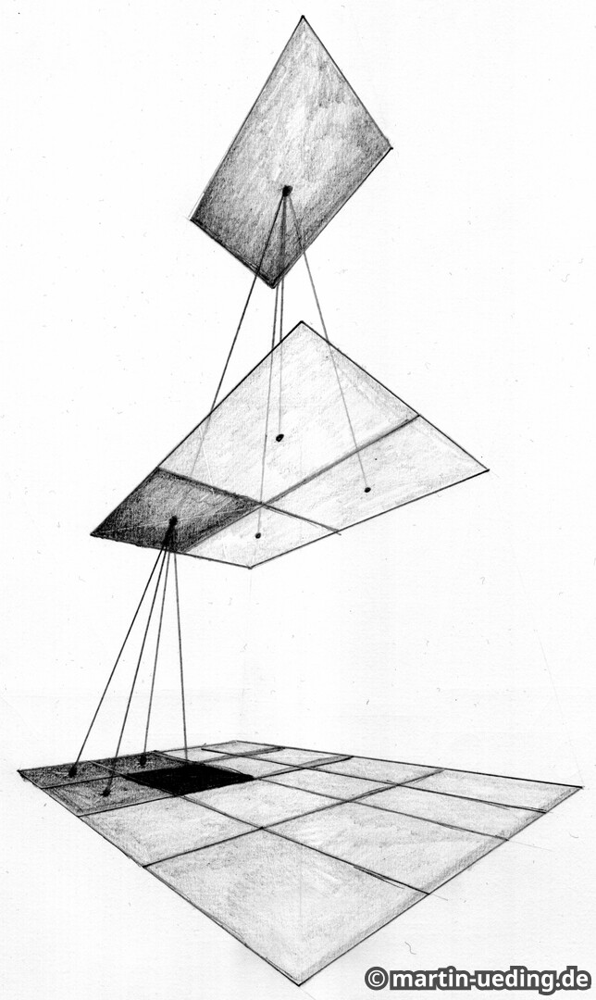
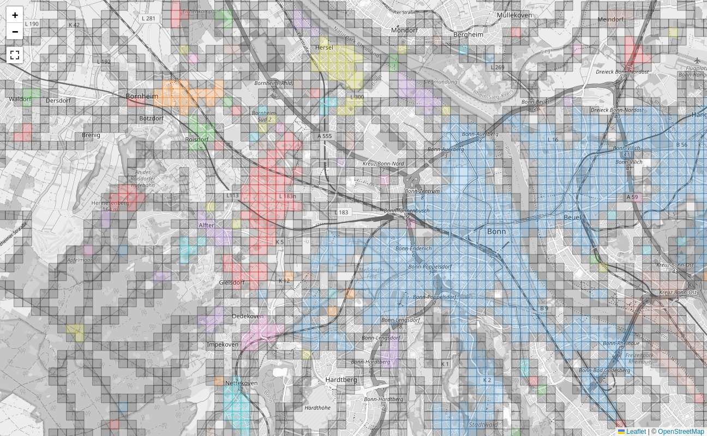

# Explorer Tiles

In this explanation you will learn about tiling scheme that Open Street Map uses. Then you will learn about the _Explorer Tiles_ that are derived from that scheme.

## Spherical earth to flat map

The world is a sphere but our computer screens are flat. Paper is also flat. How do we map the surface of earth to a flat chart? There is no unique way, there are infinitely many ways to do it. There is a field of mathematics, namely _manifold theory_, that studies this problem.

The Open Street Map uses the [_Web Mercator_](https://en.wikipedia.org/wiki/Web_Mercator_projection) coordinate system to map from latitude and longitude to coordinates on the chart. The following Python code converts _latitude_ and _longitude_ into _x_ and _y_ coordinates:

```python
def web_mercator(lat: float, lon: float, zoom: int = 14) -> tuple[int, int]:
    x = (1 + np.radians(lon) / np.pi) / 2
    y = (1 - np.arcsinh(np.tan(np.radians(lat))) / np.pi) / 2
    return x, y
```

These both range from 0 to 1, so they create a chart which contains the whole world in the unit square.

This is a convenient projection for online maps as the whole map fits into a square and not some rounded shape like for instance the [Hammer projection](https://en.wikipedia.org/wiki/Hammer_projection). The Mercator projection doesn't preserve area or angles (that's why Greenland is so big), but meridian lines are always straight and parallel to each other. The Hammer projection preserves area but the meridian lines aren't straight.

## Organizing the world

With the Web Mercator projection we have a projection into _x_ and _y_ coordinates. But these are floating point values. We need to map them to pixels. We can just multiply the coordinates with the desired image size and then have it in pixels. But in order to make out some details around your city, the image size would have to be huge. How can one render this map on a screen without creating an image file that is too large?

The establishes system in computer science is the _quad tree_ where each square region of space is split up into four quadrants. Each of these four smaller squares then splits up into another four squares. We can organize these squares in a tree, each square has its four smaller squares as children on a lower level. A quad tree with two levels looks like this:



Maps accessible via the web browser are usually served as little image tiles. These tiles exactly correspond to the squares in the quad tree. This explains how we can divide up that unit square into smaller pieces and still retain the hierarchy and a concept of neighborhood.

Each rendered tile image is 256×256 pixels in size. The zoom levels zoom in by a factor of two. As you zoom in, we use render image tiles using the squares from one deeper level in the quad tree.

The following prescription maps from latitude and longitude (given in degrees) to tile indices by making use of the fact that with each zoom level we split the square by a factor of two:

```python
def compute_tile(lat: float, lon: float, zoom: int) -> tuple[int, int]:
    x = (1 + np.radians(lon) / np.pi) / 2
    y = (1 - np.arcsinh(np.tan(np.radians(lat))) / np.pi) / 2
    n = 2**zoom
    return int(x * n), int(y * n)
```

This is how we can compute the tile number from any coordinate at any zoom level.

A map viewer will then download individual map tiles such that it can fill the whole viewport. As you pan, it will download more tiles. When you zoom, it will download different tile images. This way all it ever needs to display to you is 256×256 pixel size images, but you can explore the world on all levels this way.

## Explorer tiles

Online map viewers use these tiles but they don't show the boundaries. Hence the tiles are an implementation detail.

Somebody thought that it would be fun to use these tiles for something else. At zoom level 14 the tiles have a side length of roughly 1.5 km in Germany. These tiles are used as the basis for _explorer tiles_. The basic idea is that every tile where you have at least one point in an activity is considered an _explored tile_.

From your activities the program will extract all the tiles that you have visited. And then it does a few things with those. One main thing is that it will display these on an interactive map. When we zoom into one area where I've been on vacation in 2023, you can see the explored tiles there:


The filled tiles are explored, I have been there. The colored tiles are _cluster tiles_, that means that all their four neighbor tiles are also explored.

You can see here how I have explored a region and ensured that it is mostly contiguous.

There is another vacation from 2013 where I wasn't aware of the cluster tiles. I just did some bike trips and didn't look out for the tiles. There the tiles look like this:


You see all these gaps in there. Also there are three different clusters which are not connected. Each unique cluster is assigned a different color such that one can see where there are gaps between the cluster tiles. And filling the gaps is what the explorer tiles are about: This OCD (obsessive compulsive disorder) like craving to fill in the gaps.

Let's take a look at my main cluster of explorer tiles. Here I have explored much more than in the areas where I was on vacation.


You can see an additional feature, the blue square. This is the one largest square which can be fit into all explored tiles. In this picture it has size 21². The idea of the square is to have a really tough challenge. Not only does one need to explore increasingly many tiles to expand the square by one unit, there must not be any gaps.

As you can see in this picture, there is a tile missing right at the top edge. I will never be able to get that because that is an off-limits area of the German air force at the airport. So I can expand my square to the south only.

You can click on each tile and get some information about that particular tile. You can see when you first explored that and with which activity. Also it shows the last activity there as well as the number of activities. If it is a local cluster, it will also show the cluster size.

## Squadratinhos

The explorer tiles at zoom level 14 are best suited for cycling and to discover the area around the city. There is a derived definition, the _squadratinhos_ which are defined at zoom level 17 and therefore a factor 8 smaller in each direction. Each explorer tile is therefore divided into 256 squadratinhos.

These are better suited for walking and making sure that you really explored every little place in your neighborhood. Since they are so small, there are many properties which one cannot go onto, like industrial sites, airports or just a wide river.

For my home city it looks like this:



You can see how the squadratinhos are much smaller than the explorer tiles and how they lend themselves to more local exploring.