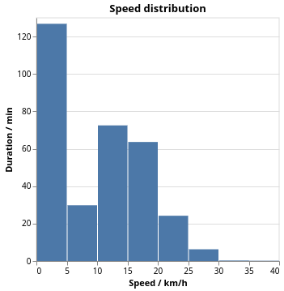

# Activity View

When you have selected a particular activity, you can view various details about it. This is what the screen looks like, we will go through the different parts in the following.

## Metadata

You have a column with metadata about the activity. The activity kind, whether it is a commute and the equipment are currently only supported via the Strava API, but we can build something to infer that from directories as well.

The calories are broken in the Strava API wrapper library that I use, therefore they don't show even if they are there.

You can also see the ID which is an internal ID. When you use Strava API as a source, it will use the IDs that Strava gives. When you use files from a directory it will be computed from a hash of the path to the activity file.

## Map with track

The interactive map shows a line with the activity. The speed is color-coded and peaks at 35 km/h with a yellow color.

## Distance, speed and altitude

Then there are a couple of time series plots. One is the distance vs. time. You can see how much distance you covered when and also see plateaus when you went on a break.

From this we can also compute the speed, although that might be pretty noisy:

And more interesting is the distribution of the various speed zones. This gives you an understanding how much time you spent at which speed. The buckets are set in 5 km/h intervals, but we could also change that.

If the time series data has the altitude, which isn't always the case, you can see it in the plot there. Here we can see how I did a tour and continually rode downhill. Except at the end where I had to climb in order to get the explorer tile that I wanted.

## Heart rate

The heart rate isn't too helpful, I feel. Still I've created the plot from the given data.

More interesting regarding the heart rate are the zones which one has spent time during this activity.

The definition of the heart rate zones is not standardized. Usually there are five zones and they have the same names. What differs is how their ranges are computed and there is some chaos around that.

All definitions that I found take the maximum heart rate as the upper limit. One can measure this as part of a professional training or just use the _220 minus age_ prescription which at least for me matches close enough. What they differ on is how they use a lower bound. It seems that [Polar](https://www.polar.com/blog/running-heart-rate-zones-basics/) or [REI](https://www.rei.com/learn/expert-advice/how-to-train-with-a-heart-rate-monitor.html) basically use 0 as the lower bound. My Garmin system also uses 0 as the lower bound. But as one can see in [this blog](https://theathleteblog.com/heart-rate-zones/), one can also use the resting heart rate as the lower bound.

Based on the maximum and resting heart rate we will then compute the heart rate zones using certain percentages of _effort_. We can compute the heart rate as the following:

> rate = effort × (maximum – minimum) + minimum

The zones then take the following efforts:

Zone | Effort | Training
---: | ---: | ---:
1 | 50 to 60 % | Warmup/Recovery
2 | 60 to 70 % | Base Fitness
3 | 70 to 80 % | Aerobic Endurance
4 | 80 to 90 % | Anerobic Capacity
5 | 90 to 100 % | Speed Training

You can decide how you want to do work with that. If you want to have the same definitions that say Garmin uses, you need to just enter your birth year and we can compute the rest. If you want to use a lower bound, you need to specify that.