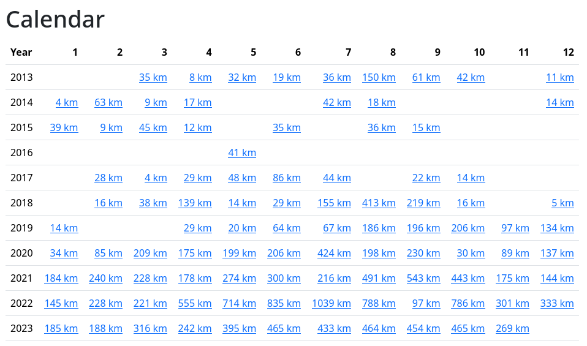

# Calendar

In order to access all the activities, there is a calendar view. It shows the years in rows and the months in columns. Each cell is a particular month and indicates the total distance traveled.

When you click on any of the months, you will see a calendar for a given month. Here is one of my months which doesn't show too personal data:

Clicking on an activity will lead you to the activity detail view.