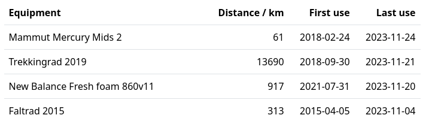
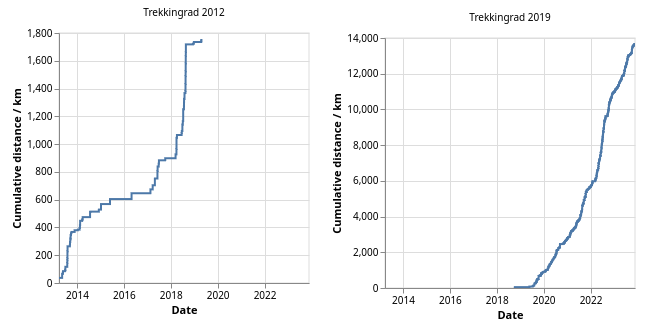

# Equipment Overview

When activities are tagged with the used equipment, one can tally the total distance traveled with each thing. This given as a table with the recently used equipment at the top:

And for each thing there is also a graph which shows how the distance accumulates over time:

Here one can see how with my old bike I only recorded the occasional bike trip and not nearly the 4000 km/a which I was doing. And then it got stolen in 2019, so I bought a new bike.

 This metadata is downloaded via the Strava API, for the directory source it is not yet supported. I thought about using directories like `Activities/{Activity Kind}/{Equipment Name}/{Activity Name}.gpx`. to indicate the kind and equipment. If you're interested in implementing this, let me know.