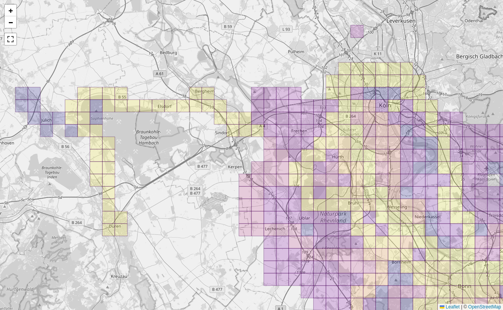
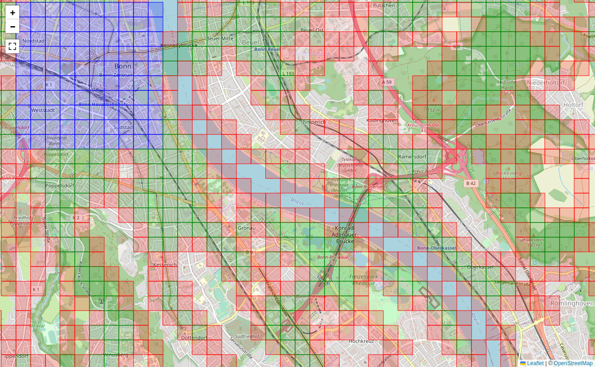
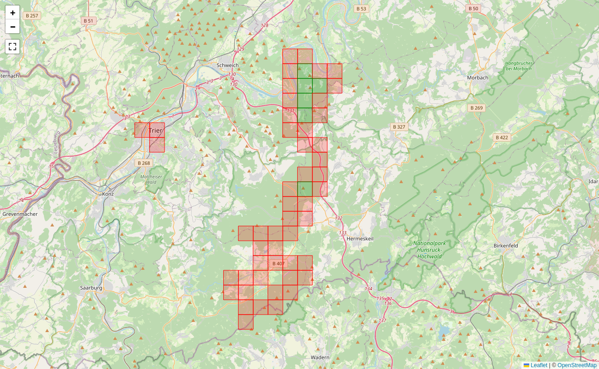
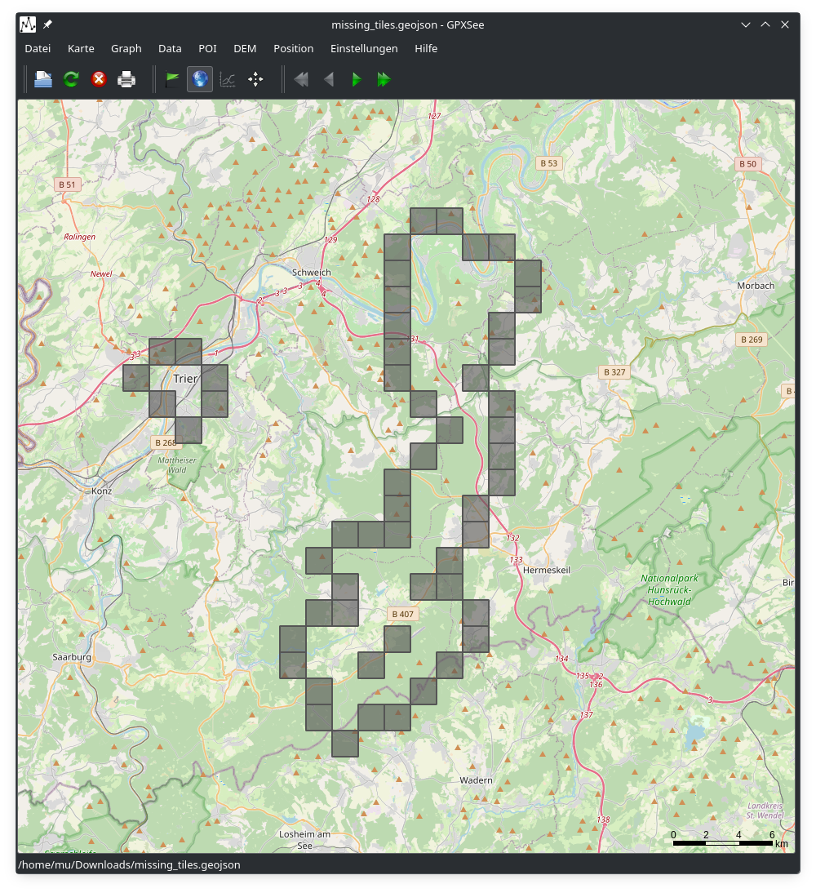

# Explorer Tiles

Maps accessible via the web browser are usually served as little image tiles. The Open Street Map uses the _Web Mercator_ coordinate system to map from latitude and longitude to pixels on the map.

Each tile is 256×256 pixels in size. The zoom levels zoom in by a factor of two. Therefore all the tiles are organized in a _quad tree_. As you zoom in, each tile gets split into four tiles which can then show more detail. The following prescription maps from latitude and longitude (given in degrees) to tile indices:

```python
def compute_tile(lat: float, lon: float, zoom: int = 14) -> tuple[int, int]:
    x = np.radians(lon)
    y = np.arcsinh(np.tan(np.radians(lat)))
    x = (1 + x / np.pi) / 2
    y = (1 - y / np.pi) / 2
    n = 2**zoom
    return int(x * n), int(y * n)
```

At zoom level 14 the tiles have a side length of roughly 1.5 km in Germany. These tiles are used as the basis for _explorer tiles_. The basic idea is that every tile where you have at least one point in an activity is considered an _explored tile_.

From your activities the program will extract all the tiles that you have visited. And then it does a few things with those. One main thing is that it will display these on an interactive map. When we zoom into one area where I've been on vacation in 2023, you can see the explored tiles there:


The filled tiles are explored, I have been there. The colored tiles are _cluster tiles_, that means that all their four neighbor tiles are also explored.

You can see here how I have explored a region and ensured that it is mostly contiguous.

There is another vacation from 2013 where I wasn't aware of the cluster tiles. I just did some bike trips and didn't look out for the tiles. There the tiles look like this:


You see all these gaps in there. Also there are three different clusters which are not connected. Each unique cluster is assigned a different color such that one can see where there are gaps between the cluster tiles. And filling the gaps is what the explorer tiles are about: This OCD (obsessive compulsive disorder) like craving to fill in the gaps.

Let's take a look at my main cluster of explorer tiles. Here I have explored much more than in the areas where I was on vacation.


You can see an additional feature, the blue square. This is the one largest square which can be fit into all explored tiles. In this picture it has size 21². The idea of the square is to have a really tough challenge. Not only does one need to explore increasingly many tiles to expand the square by one unit, there must not be any gaps.

As you can see in this picture, there is a tile missing right at the top edge. I will never be able to get that because that is an off-limits area of the German air force at the airport. So I can expand my square to the south only.

You can click on each tile and get some information about that particular tile. You can see when you first explored that and with which activity. Also it shows the last activity there as well as the number of activities. If it is a local cluster, it will also show the cluster size.


There is also the option to color the tiles by first or last visit. Use one of the buttons above the map:


Then the map will show the first visit:


Or how recent your last visit is:



This uses Matplotlib's _Plasma_ scale (see below) to color the age of a tile. Very new tiles will get a yellow color, a year old tiles a reddish color and tiles two years old or older a colder blue. This is the scale:


You can switch this with the buttons above the map.

## Squadratinhos

The explorer tiles at zoom level 14 are best suited for cycling and to discover the area around the city. There is a derived definition, the _squadratinhos_ which are defined at zoom level 17 and therefore a factor 8 smaller in each direction. Each explorer tile is therefore divided into 256 squadratinhos.

These are better suited for walking and making sure that you really explored every little place in your neighborhood. Since they are so small, there are many properties which one cannot go onto, like industrial sites, airports or just a wide river.

For my home city it looks like this:



You can see how the squadratinhos are much smaller than the explorer tiles and how they lend themselves to more local exploring.

## History

The map only shows the current state of your explorer tiles. In order to get a sense of how many new tiles you have discovered in the past, there are also plots that show you how you have extended the total number of squares, the size of your largest cluster and the size of your largest square over time:


## Missing tile files

Looking at these maps you can see the gaps. And if you feel challenged to fill those, you might want to plan a “tactical bike ride” to explore those. Take for instance this set of tiles from a vacation:



You can see those two gaps in the south. To make identifying these gaps a bit easier there is a second map which shows you the missing tiles. It has the gaps and also a border around the explored tiles:


One can use those maps to plan the routes. You can also download these maps as a GeoJSON file and use other programs to display them. For instance with GPX See on Linux it looks like this:



I have not tested this software, but supposedly [Offline Maps](https://play.google.com/store/apps/details?id=net.psyberia.offlinemaps) is able to display GeoJSON on Android.

On Android I use the OsmAnd app to display tracks and also try to visualize the missing tiles. Unfortunately [GeoJSON is not supported](https://osmand.net/docs/technical/osmand-file-formats/), therefore one has to play some tricks. The missing tiles are also exported as a GPX file with a track for each missing tile. This looks strange, but it is a bit helpful with OsmAnd. This is how the file looks like in GPXSee:


And on OsmAnd it looks like this:


Unfortunately OsmAnd becomes a bit sluggish with such a huge track imported, so I don't have this displayed all the time.