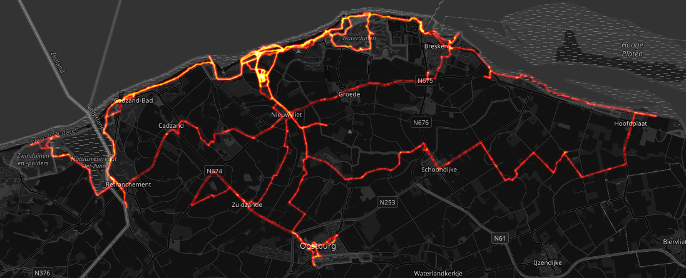

# Heatmaps

A heatmap shows where you have been more often than other places. There is an interactive and zoomable heatmap that looks like this:

Here you can see where I mostly travel between Bonn and Cologne.

The heatmap computation is based on the [Strava local heatmap code](https://github.com/remisalmon/Strava-local-heatmap). For the interactive map I needed to adjust it a lot. It might be possible that heatmaps don't look very nice if you have a different recording interval from the one that I use.

## Heatmap images

There is a second mode to generate heatmap images. Instead of using the `serve` command, use the `heatmaps` command. That will generate heatmap images with carefully adjusted colors using the original logic of [Strava local heatmap](https://github.com/remisalmon/Strava-local-heatmap).

We don't generate a single heatmap for all your activities as this will not look great as soon as you have done an activity away from home. Rather we use a clustering algorithm to find all disjoint geographical clusters in your activities and generate one heatmap per cluster.

For instance the heatmap generated from all my activities in the [Randstad](https://en.wikipedia.org/wiki/Randstad) in the Netherlands:

And the activities around Nieuwvliet-Bad look like this:

These images are put into the `Heatmaps` directory in your playground.