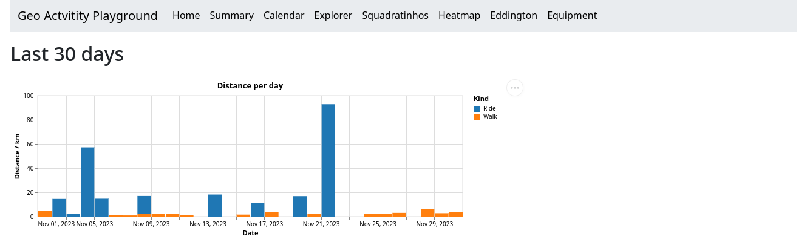

# Overview page

When you start the webserver, you will see the overview page. It looks like the following and shows the activities you've done in the past 30 days:

Then below that you see the latest 15 activities with their tracks on interactive maps.

Each card contains the name, activity type, distance and duration. The non-commute activities are highlighted with a blue border, the commutes just have a gray border.

Click on any of the names and you will see the details of that activity.