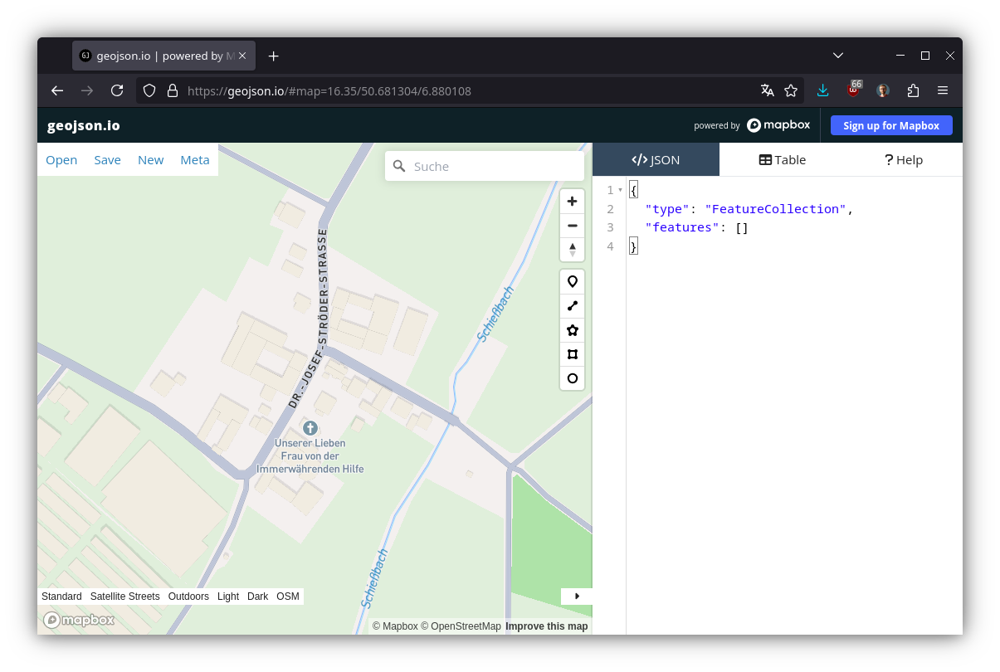

# Share Picture

On each activity page you will find a "share picture" like the following:


## Privacy zones

You might want to remove points that are close to your home, work or relatives. For this you can define arbitrary polygons as "privacy zones".

To create such a polygon, go to [GeoJSON.io](https://geojson.io/). You will see a map similar to this one:



Select the polygon tool and click on the map to span the polygon.


Once you are done, press <kbd>Enter</kbd> to finish the polygon. In the left panel the GeoJSON output will appear:


For this case, we have this GeoJSON:

```json
{
  "type": "FeatureCollection",
  "features": [
    {
      "type": "Feature",
      "properties": {},
      "geometry": {
        "coordinates": [
          [
            [
              6.87987514009842,
              50.68272071401333
            ],
            [
              6.878628929151887,
              50.6819310903943
            ],
            [
              6.8780142440226655,
              50.68125883278765
            ],
            [
              6.879563587362242,
              50.68022375065988
            ],
            [
              6.880599289703014,
              50.68029311254671
            ],
            [
              6.8814665851591315,
              50.68102940933676
            ],
            [
              6.881542368256589,
              50.681723011688035
            ],
            [
              6.8812729172415175,
              50.682176515374465
            ],
            [
              6.87987514009842,
              50.68272071401333
            ]
          ]
        ],
        "type": "Polygon"
      }
    }
  ]
}
```

Paste this in the appropriate settings menu.

You can name the zone to help you remember what it encompasses. You can add multiple zones.

Points that are within any of the privacy zones will not be shown in the share pictures. Except when _all_ of the points are in the privacy zone, then all the points will be shown.