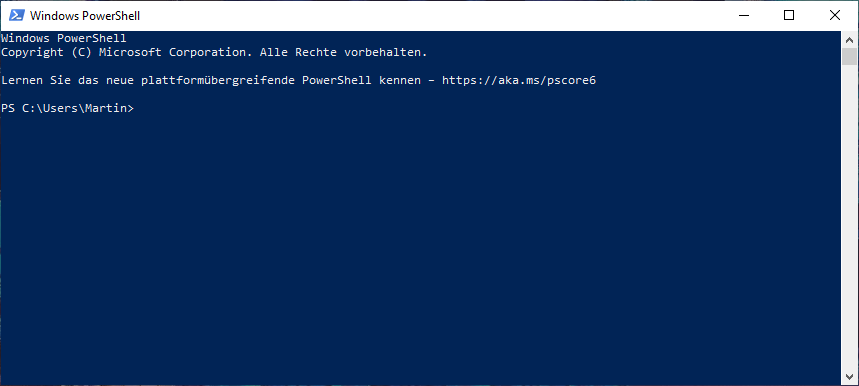
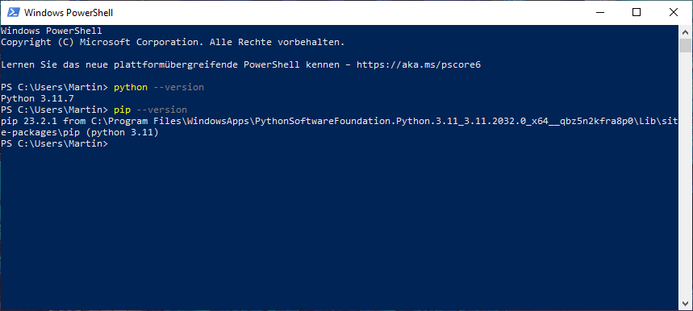
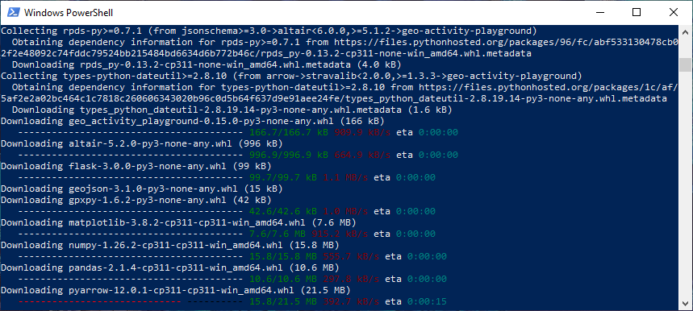
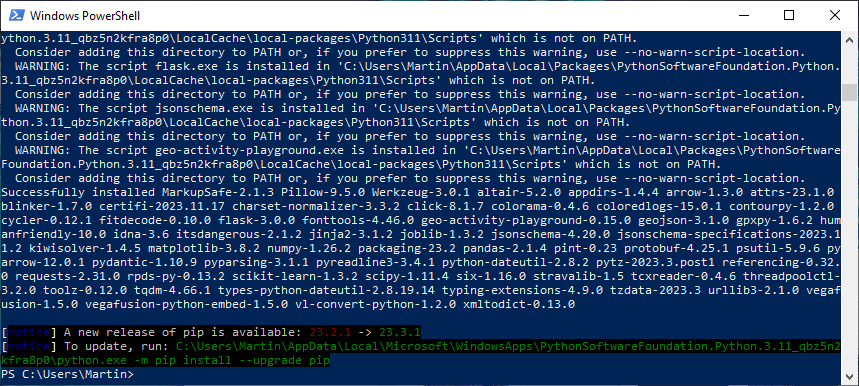

 
# Installing Stable on Windows

This how-to will show you the installation of the project on Windows. Here in the guide we use Windows 10 with the locale set to German, it should generalize to Windows 11 as well.

## Installing Python

First we need to install Python because that doesn't ship with Windows. Fortunately we can get it from the _Microsoft Store_. Open that via the start menu and you should see something like this:


Type “Python” into the search bar at the top. In the search results you likely see different Python versions like 3.11 and 3.10. The project is compatible with 3.11, 3.10 and 3.9; I'd suggest to just go with 3.11. In case that you have already installed one of the other compatible versions, you can skip this step.

Here we select Python 3.11.


In the top right there is a blue button to install the software. Click that.

## Installing the project

After that has run through, you need to open the _Power Shell_ via the start menu. It should open a command line window like this:



We can verify that Python is working by entering `python --version` and `pip --version`. It should give a sensible version message like this:



Then we can ues PIP to install the project. Type the following:

    pip install -U geo-activity-playground

It should look like this:


Then press <kbd>Enter</kbd> and it will install it, looking like this:



That might take a while. After that has run through, it should give a success message:



Then we're done with this window, you can close it now.

## Putting your activity files in place

Next you need to create a folder to put the files. I've placed mine just into the _Documents_ folder. In there I've created a folder named exactly “Activities”.


Inside this folder there are my GPX/FIT/TCX/KML files as outlined in [how-to guide on using activity files](using-activity-files.md).


You need to have at least one activity file before you can start the program.

## Starting the webserver

Once you have your activity files in place, we need to add a start script. Right-click into the playground folder (next to the “Activities folder”) and in the context menu select “Create New” and then “Text File”. Name it `start.bat`. Windows will ask you whether want to change the suffix (file extension) because it might get unusable. Yes, we want to do that. It should look like this:


Then right-click on that file and select “Edit”. A text editor will open up. Put the following content into this file:

```bat
python -m geo_activity_playground serve
pause
```

Then save and close it. I need you to create this file yourself and cannot offer a download because the Windows Defender will not allow you to execute such script files downloaded as a security precaution. If you create the file yourself, it will let you execute it.

Once you have the `start.bat` there, you can double-click on it to execute it. A new terminal window should open and it should start to parse your activities.


After it has loaded everything, you can open <http://127.0.0.1:5000/> in your browser. You should then see the landing page:


Also other functions like the heatmap work:


That's it, have fun!