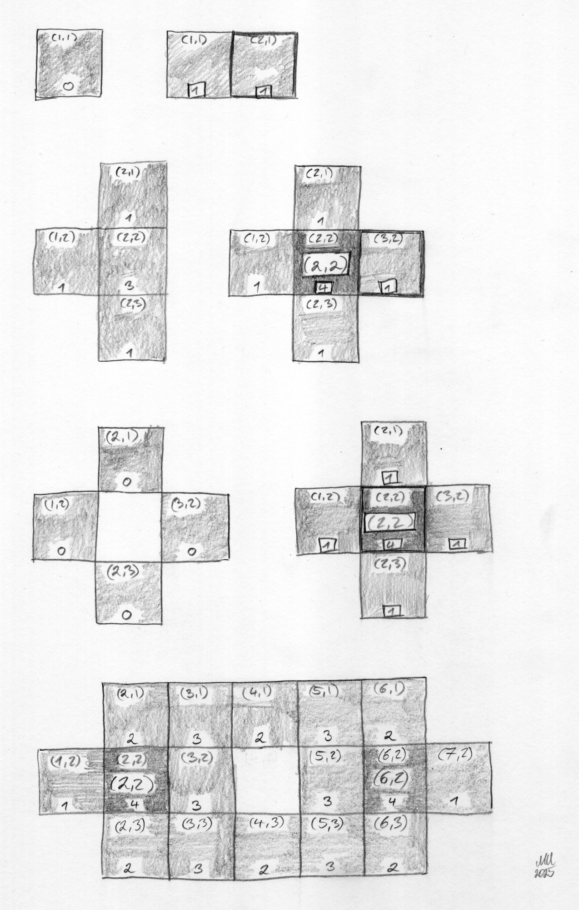
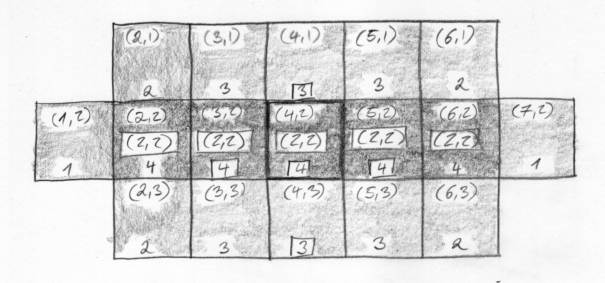

# Incremental Cluster Algorithm

In this explanation you will learn how the incremental cluster algorithm works for explorer tiles.
The goal is to explain the model and why it is implemented this way, not to teach API usage.

## Problem setting

For a given zoom level, we process tile first-visits in chronological order.
Each visited tile can become a _cluster tile_ once all four cardinal neighbors are visited as well.
Cluster size is then the size of connected components of cluster tiles (4-neighborhood).

This is intentionally local: when a new visit arrives, only that tile and its direct neighbors can change state.

## Mental model

Think of each tile as having two states:

- **Visited**: at least one activity has entered this tile.
- **Cluster-active**: the tile is visited _and_ has all four cardinal neighbors visited.

The algorithm keeps three pieces of evolving state:

- `visited_tiles`: set of all visited tiles.
- `neighbor_counts`: how many of the four neighbors are already visited for each visited tile.
- Union-Find over cluster-active tiles (`parents`, `component_sizes`) to track connected cluster components efficiently.

The largest cluster at a point in time is the maximum component size in that Union-Find.

## Incremental update rule

When a new tile `t` is visited:

1. Ignore it if it was already visited before.
2. Mark `t` as visited and initialize `neighbor_counts[t] = 0` if missing.
3. For each of the four neighbors `n` of `t`:
   - If `n` is already visited:
     - increment `neighbor_counts[t]`
     - increment `neighbor_counts[n]`
     - if `neighbor_counts[n]` reaches `4`, activate `n` as a cluster tile
4. If `neighbor_counts[t]` is `4`, activate `t` as a cluster tile.
5. Activating a cluster tile inserts it into Union-Find and unions it with already-active adjacent cluster tiles.

Only local neighbor counts change, but these local activations can connect larger components through Union-Find merges.

## Why this is efficient

Without incremental bookkeeping, one would repeatedly rescan all visited tiles to recompute:

- who is cluster-active,
- and how large each connected cluster is.

The incremental approach avoids that global recomputation:

- Neighbor accounting is `O(1)` per event (constant number of neighbors).
- Union-Find operations are near-constant amortized time.
- Largest-cluster tracking is updated during unions, so it is always available.

That makes the algorithm suitable for replaying long visit histories and for event-by-event visualization.

## Visual walkthrough

The following hand-drawn diagrams illustrate the state transitions:

The first part shows local activation behavior:

- A center tile alone has `0` visited neighbors.
- With one or more neighbors, the center count increases.
- Exactly at four neighbors, the center becomes cluster-active.
- If two cluster-active regions touch, they merge into a larger component.

Several tiles independently reach the “all four neighbors visited” condition.
As soon as adjacent cluster-active tiles exist, Union-Find merges them and the global maximum cluster size increases.

## Historical replay and checkpoints

The implementation persists a chronological stream of tile events and periodically stores serialized checkpoints of replay state.
To reconstruct state at an arbitrary event index:

1. Load the latest checkpoint at or before that index.
2. Replay only the remaining events.

This keeps random access practical while preserving an exact incremental definition of cluster growth over time.
