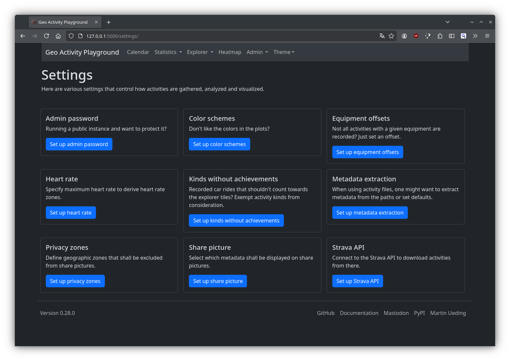

# Home

Geo Activity Playground is a software to view recorded outdoor activities and derive various insights from your data collection. All data is kept on your machine, hence it is suitable for people who have an affinity for data analysis and privacy.

It caters to serve a similar purpose as other systems like [Strava](https://strava.com/), [Statshunters](https://statshunters.com/) or [VeloViewer](https://veloviewer.com/), though the focus here is on self-hosting and using local files.

One can use this program with a local collection of activity files (GPX, FIT, TCX, KML, CSV) or via the Strava API. The latter is appealing to people who want to keep their data with Strava primarily. In case that one wants to move, this might provide a noncommittal way of testing out this project.

The main user interface is web-based, you can run this on your Linux, Mac or Windows laptop. If you want, it can also run on a home server or your personal cloud instance.

## Screenshot tour

This is the view of a single activity:

You also get a beautiful interactive heatmap of all your activities:

Also there are plenty of summary statistics that lets you track how many rides, walks or hikes you have done:

If you're into _explorer tiles_ or _squadratinhos_, this got you covered:

The configuration options are available within the interface such that you do not have to work with configuration files (like in earlier versions):

## Get started

Install the software using one of the following options:

- [Using the stable version on Linux](getting-started/installing-stable-on-linux.md)
- [Using the stable version on Windows](getting-started/installing-stable-on-windows.md)
- [Using the development version on Linux](getting-started/installing-git-on-linux.md)

Get your activity data in place using one of the following options:

- [Use local activity files](getting-started/using-activity-files.md) if you already have these.
- [Use the Strava API](getting-started/using-strava-api.md) if you want to use this project to analyse your data on Strava.
- [Move from Strava](getting-started/moving-from-strava.md) if you wan to leave Strava and work locally from then on.

## Free software

You can [find the code on GitHub](https://github.com/martin-ueding/geo-activity-playground) where you can also file issues. If you would like to use this yourself or contribute, feel free to reach out via the contact options [from my website](https://martin-ueding.de/). I would especially appreciate improvements to the documentation. If you're familiar with Markdown and GitHub, you can also directly create a pull request. The code is licensed under the very permissive MIT license.