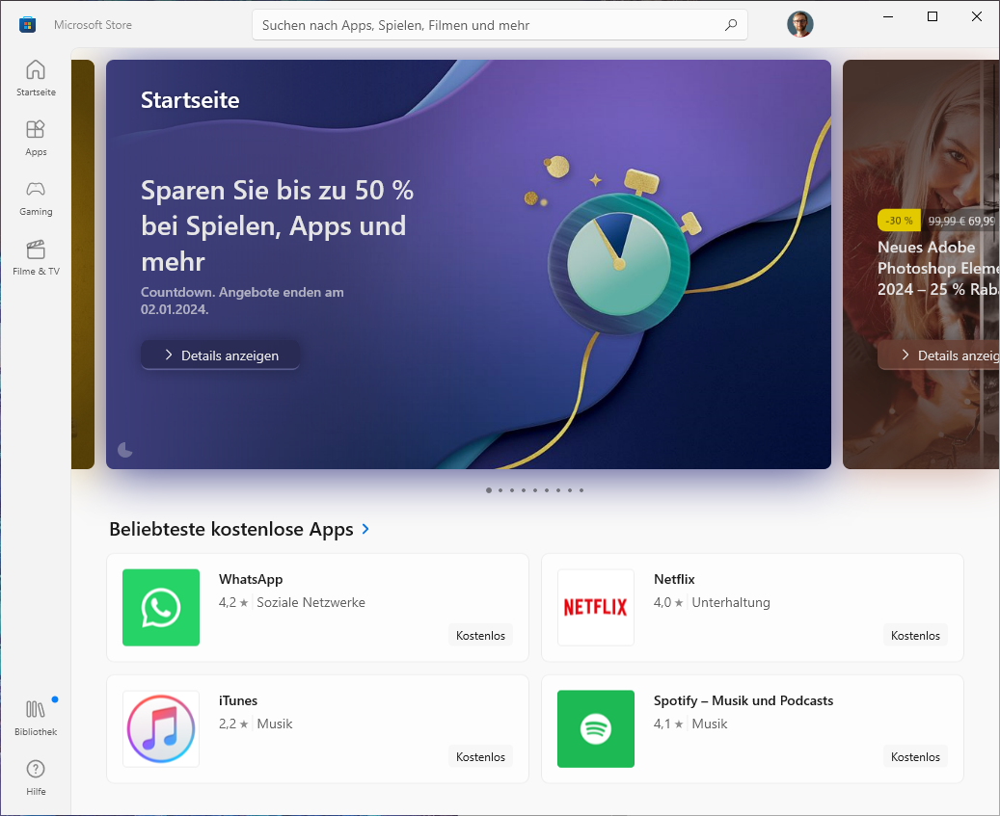
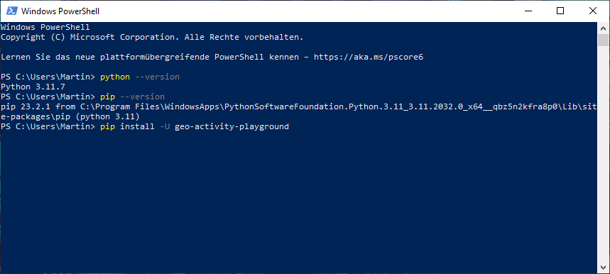

# Install on Windows

This how-to will show you the installation of the project on Windows. Here in the guide we use Windows 10 with the locale set to German, it should generalize to Windows 11 as well.

## Installing Python

First we need to install Python because that doesn't ship with Windows. Fortunately we can get it from the _Microsoft Store_. Open that via the start menu and you should see something like this:

Type “Python” into the search bar at the top. In the search results you likely see different Python versions like 3.11 and 3.10. The project is compatible with 3.10 to 3.12; I'd suggest to just go with 3.12. In case that you have already installed one of the other compatible versions, you can skip this step.

Here we select Python 3.11.

In the top right there is a blue button to install the software. Click that.

## Installing the project

After that has run through, you need to open the _Power Shell_ via the start menu. It should open a command line window like this:

We can verify that Python is working by entering `python --version` and `pip --version`. It should give a sensible version message like this:

Then we can ues PIP to install the project. Type the following:

    pip install -U geo-activity-playground

It should look like this:

Then press <kbd>Enter</kbd> and it will install it, looking like this:

That might take a while. After that has run through, it should give a success message:

Then we're done with this window, you can close it now.

## Next steps

As a next step you need to [create a base directory](create-a-base-directory.md).