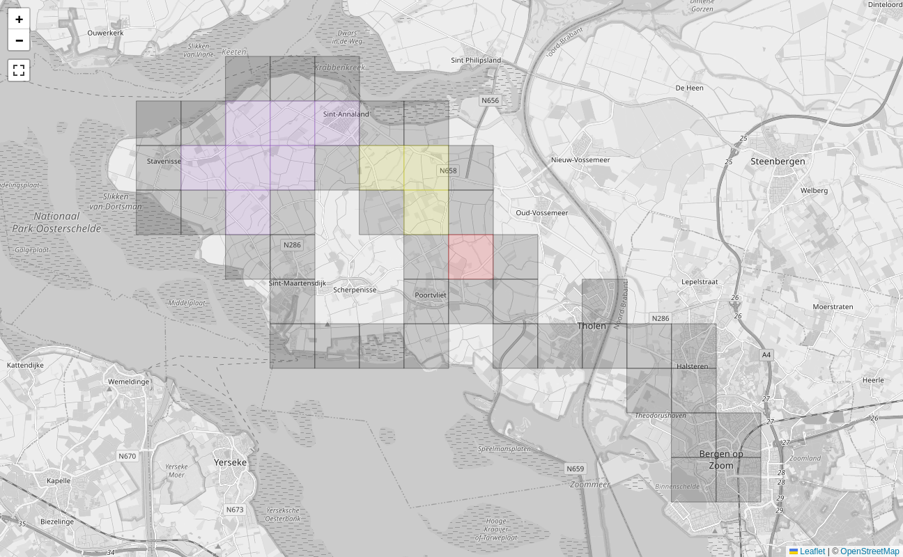
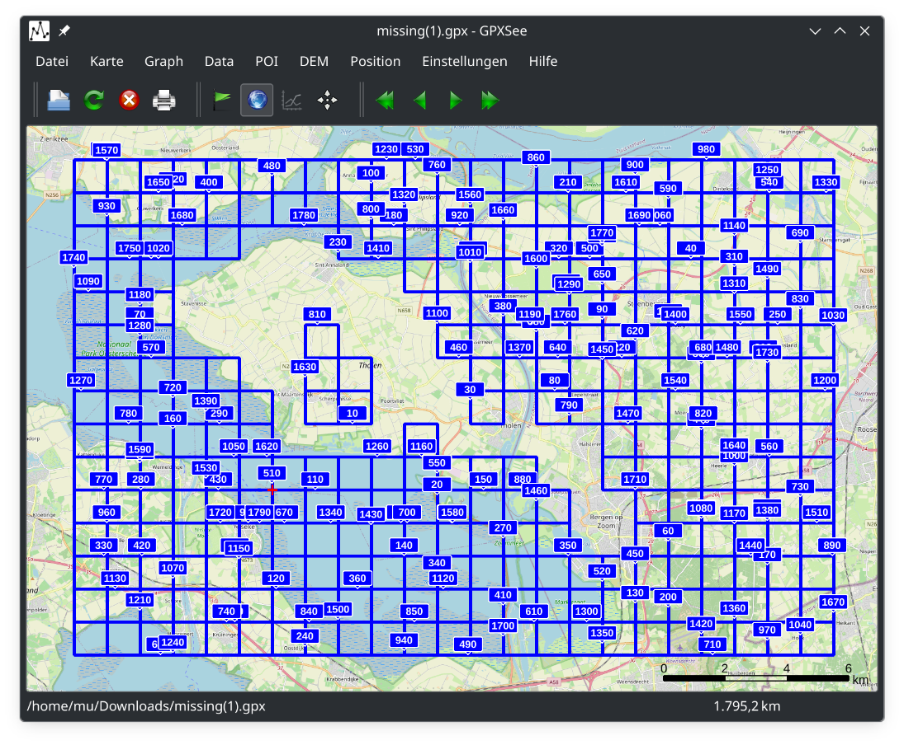
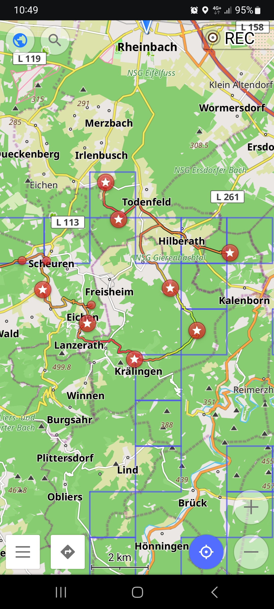

# Plan Missing Tile Rides

Looking at these maps with _explorer tiles_ you can see the gaps. And if you feel challenged to fill those, you might want to plan a “tactical bike ride” to explore those. In this how-to guide you will learn how to export the missing tiles, plan a route and get navigated along it.

## Missing tile files

Let us take another look at my tile history in Sint Annaland:

You can see those gaps in the clusters. To make it easier to explore tiles while on the go, we can export a file with the missing tiles. Pan and zoom the map to an area which you want to export. Below the map you will find two links:

> Download missing tiles in visible area as **GeoJSON** or **GPX**.

This export is available as GeoJSON or GPX such that you can open it with other applications. For instance with GPX See on Linux it looks like this when opening the GeoJSON file:

You can then upload the GeoJSON file to [Bikerouter](https://bikerouter.de/) and it will display there:

Then plan a route that goes through as many tiles as possible. Download the route as GPX and use an app like OsmAnd to ride along it.

## Missing tiles on the go

The above is nice to plan the route, perhaps you also want to take the missing tiles along to do spontaneous tile hunting.

[Organic Maps](https://organicmaps.app/), or the community fork [CoMaps](https://www.comaps.app/), are FOSS apps that can display offline maps and missing tiles GPX files on Android or iOS devices.

Another method is to use Open Street Map uMap, either the one hosted in [Germany](https://umap.openstreetmap.de/) or [France](https://umap.openstreetmap.fr/). Then you can create a new personal map (consider limiting the access rights, default is public) and upload the GeoJSON file. Then you can use that map on the code to see your position and the missing tiles:

Yet another option is [Offline Maps](https://play.google.com/store/apps/details?id=net.psyberia.offlinemaps). That is able to display GeoJSON on Android, though one needs to buy the add-on for like 5 EUR.

On Android one can use the OsmAnd app to display tracks and also try to visualize the missing tiles. Unfortunately [GeoJSON is not supported](https://osmand.net/docs/technical/osmand-file-formats/), therefore one has to play some tricks. The missing tiles are also exported as a GPX file with a track for each missing tile. This looks strange, but it is a bit helpful with OsmAnd. This is how the file looks like in GPXSee:

And on OsmAnd such files look like this:

Unfortunately OsmAnd becomes a very sluggish with such a huge track imported, so make sure to only export it from rather small regions.

## Square planner

From the explorer tile views you can open the _square planner_ which allows you to see which tiles you need to explore in order to extend the square into a particular direction. The screen will open with the largest square that you have, then you can use the buttons to extend or move your square.

Using the buttons in the middle you can move the square, the buttons in the corners allow to extend or shrink the square.

When you have selected the square that you want to target, you can download the missing files in for that square as GeoJSON or GPX.