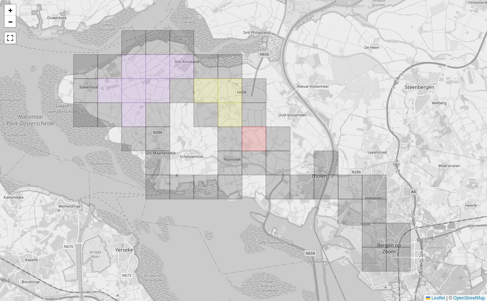
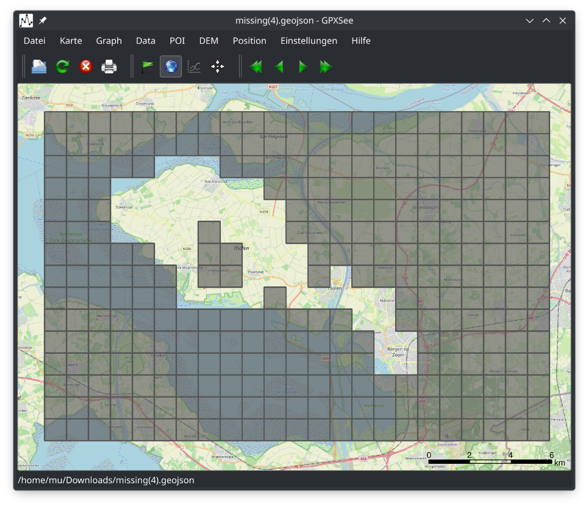
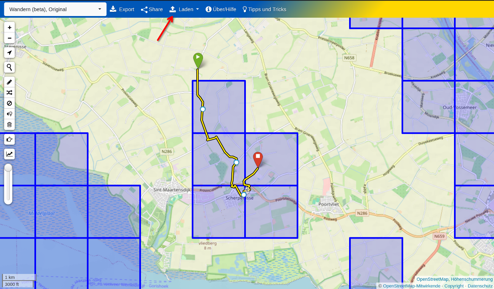
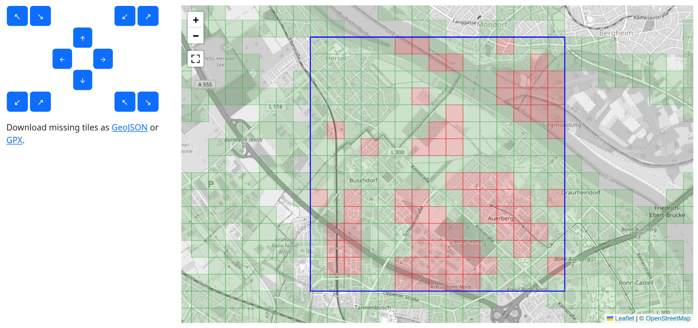

# Plan Missing Tile Rides

Looking at these maps with _explorer tiles_ you can see the gaps. And if you feel challenged to fill those, you might want to plan a “tactical bike ride” to explore those. In this how-to guide you will learn how to export the missing tiles, plan a route and get navigated along it.

## Missing tile files

Let us take another look at my tile history in Sint Annaland:

You can see those gaps in the clusters. To plan a route through them, export a file with the missing tiles. Pan and zoom the map to the area which you want to export, then use the link below the map:

> Download missing tiles in visible area as **GeoJSON**.

Opened with GPXSee on Linux, the GeoJSON file looks like this:

Upload the GeoJSON file to [Bikerouter](https://bikerouter.de/) and it will display there:

Then plan a route that goes through as many tiles as possible. Download the route as GPX and use an app like OsmAnd to ride along it. To carry the missing tiles themselves along for spontaneous hunting, see [Explorer Tiles on the Go](/explorer-tiles-on-the-go).

## Square planner

From the explorer tile views you can open the _square planner_ which allows you to see which tiles you need to explore in order to extend the square into a particular direction. The screen will open with the largest square that you have, then you can use the buttons to extend or move your square.

Using the buttons in the middle you can move the square, the buttons in the corners allow to extend or shrink the square.

When you have selected the square that you want to target, you can download the missing files in for that square as GeoJSON or GPX.