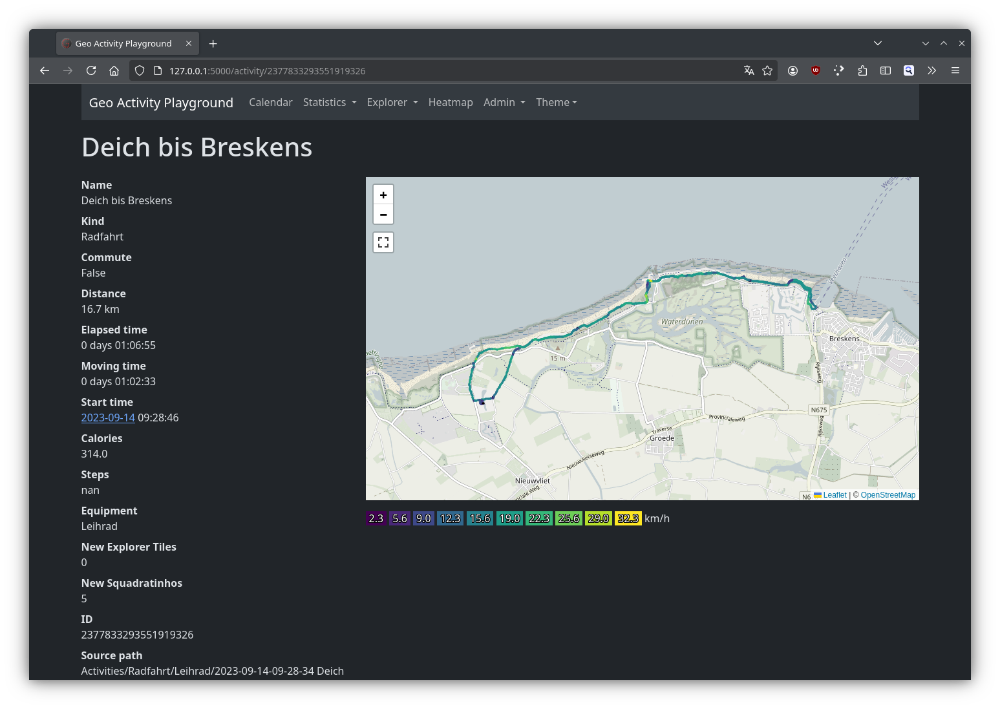
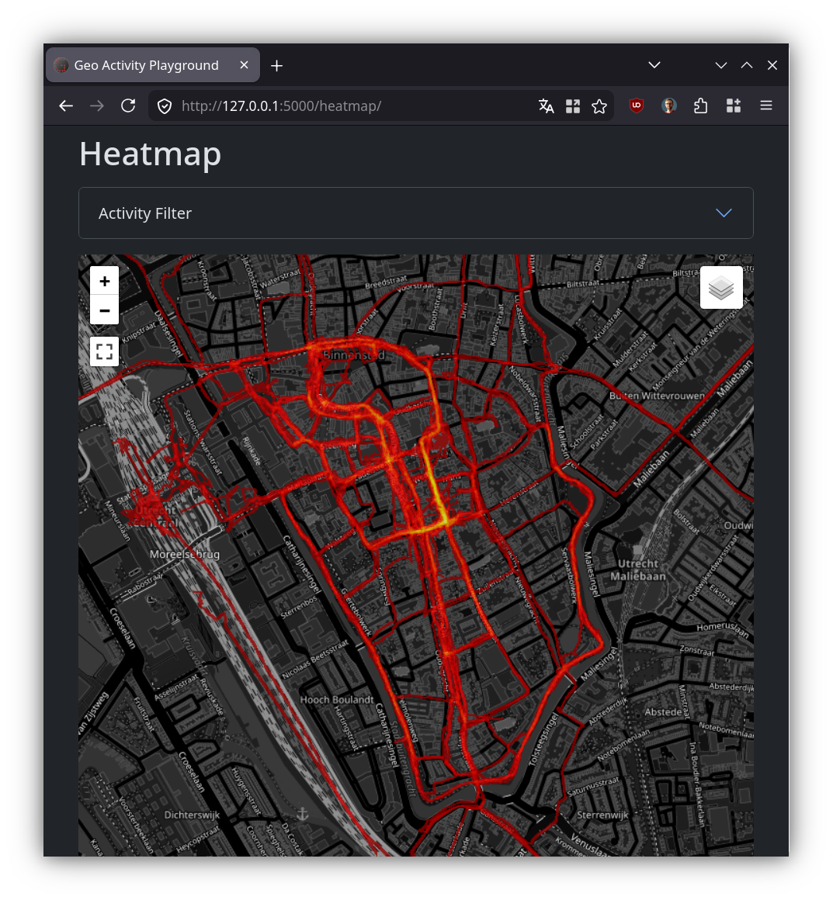
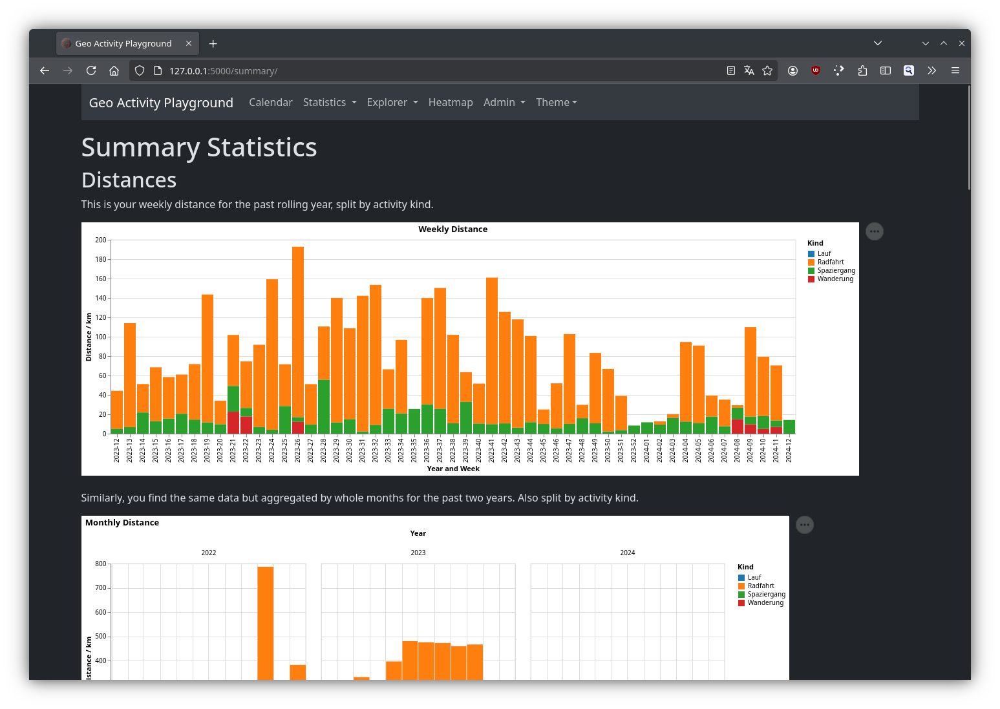
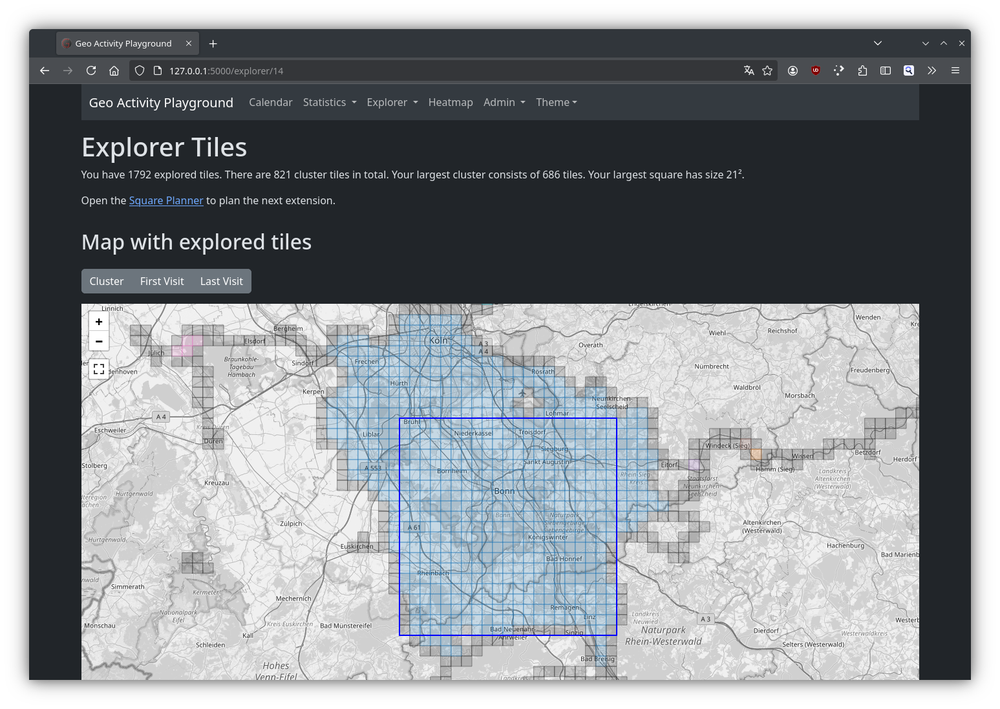
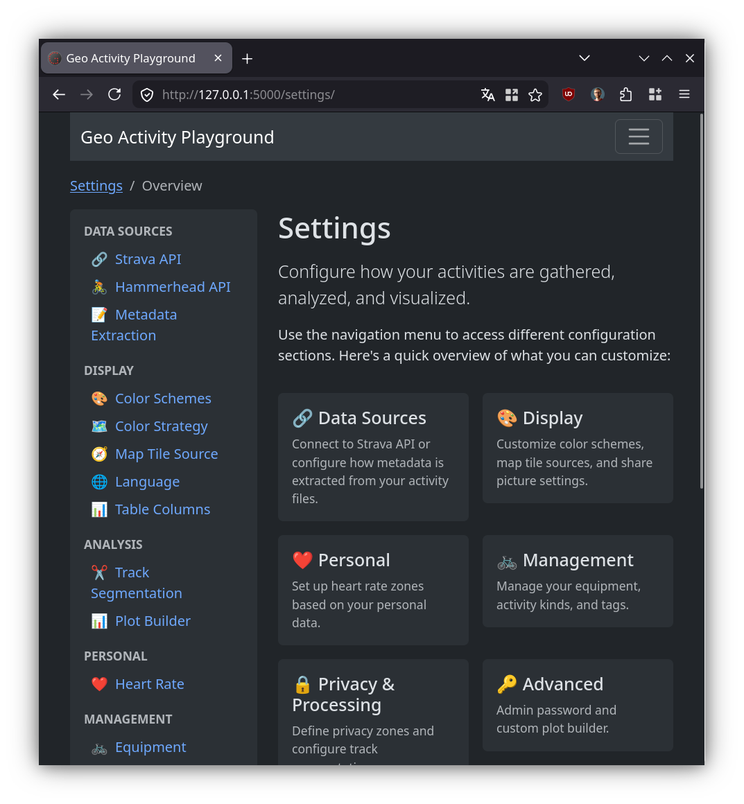

# Screenshot Tour

This is the view of a single activity:

You also get a beautiful interactive heatmap of all your activities:

Also there are plenty of summary statistics that lets you track how many rides, walks or hikes you have done:

If you're into _explorer tiles_ or _squadratinhos_, this got you covered:

The configuration options are available within the interface such that you do not have to work with configuration files (like in earlier versions):

