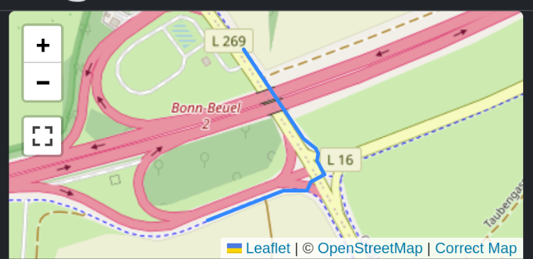
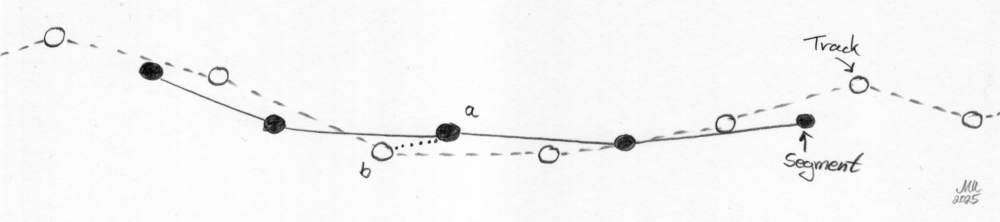
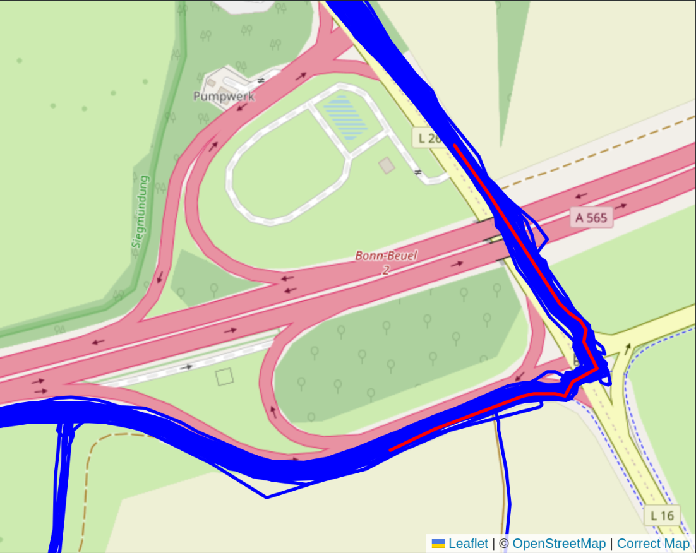
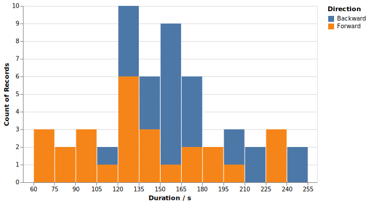
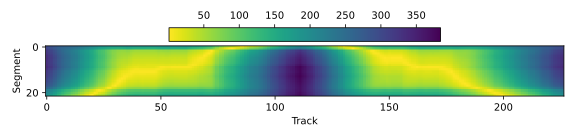

# Segment Matching

In this background document we will look at the algorithm used to match tracks to segments. First we handle the easy case, then we look at cases where the same segment is traversed multiple times within a single track.

We start by defining a segment to cover one leg on an intersection, like this:



There are many activity lines that pass along that area. But not all of them really take that segment. You can see that there are a lot of rides along that segment, but some that follow different routes.


What we want to have are all the tracks which contain the segment. Or least close enough, whatever that means in detail.

Although they are shown as solid lines in these images, both the segment as well as the tracks are defined as a list of points only. And the segment is created via a routing service, but the track points are measurements with considerable jitter. We need to have something that works with single points and is robust to measurement uncertainty. In the following drawing, we see both segment (with solid points and solid line) and the track (with open points and dashed line):



What we use is an asymmetric Hausdorff distance. For every point in the segment, we pick the closest point in the track and take this distance. In the drawing, take segment point "a", then the closest track point is "b". For each segment point, we will get a distance to the track in this way. From all these distances, we take the maximum. This is a measure for the biggest distance between segment and track. If this maximum distance is closer than a threshold (say 20 meters), we consider the segment contained in the track.

Here is the code that is used. We have four one-dimensional arrays that contain the segment latitude and longitude (`slat` and `slon`) as well as the track latitude and longitude (`tlat` and `tlon`). We use NumPy slices with `None` in order to convert these to two-dimensional arrays and compute the distances. The first axis (`axis=0`) corresponds to the sequence points, the second axis (`axis=1`) to the track points. We compute the minimum along the track axis to pick the closest track point to every sequence point. And then we take the maximum of these minimum distances to get the one-sided Hausdorff distance.

```python
d = get_distance(slat[:, None], slon[:, None], tlat[None, :], tlon[None, :])
min_d = np.min(d, axis=1)
return np.max(min_d)
```

When we apply this to some data, we get the following map with a ton of matched tracks. You can see one strange route that branches off to the south. Either the matching is not strict enough or I really did ride both ways and returned.



We can take the track points that are closest to the first and last point in the segment. These are our "entry" and "exit" track points. From these we can take the timestamp and compute the duration that was spent along the segment. If entry and exit are swapped, we know that the segment was passed in the backward direction. We can display the durations in a histogram like this:



This works fine until there are multiple passes in a single track.

## Multiple passes

When looking at the histogram for a big data set, one will find strange outliers:


The reason for these is that there are tracks where the same segment is passed multiple times. In this case it is passed on the way to the location and back.


The situation we have here is more involved because just finding the closest track point for each segment point will match either pass. Take this case where one does an additional lap and passes through the segment again:


When looking at the closest track point for each segment point, it might match to the first or second pass. With a little jitter from the GPS, the situation would completely change. This is not robust enough. The problem is that we take the minimum distance without taking into account the continuity of this.

## Distance map

Let us take a look at this distance matrix `d` that was computed with the above code. In this particular case it is rather boring because it has shape (22, 7950) from 22 segment points against 7950 track points. The distances are usually pretty far because the points are far away from the segment. Let us drop all the track points that are farther than 200 meters away from the nearest segment point. Then we get this version where there are two cut-outs joined together:



We can see two diagonal lines here and the plot is mostly symmetric across the middle. The left half is one pass through the segment, the right pass is another. The yellow diagonal are the combination with the least distance.

What we basically want is to find these diagonals, even if they occur multiple times or even in reverse. But it needs to be a full diagonal such that the whole segment is traversed.

We now divide this into segments by requiring that a segment match _candidate_ needs to have continuous proximity between segment and track. We take a threshold of 100 meters in order to enforce that between passes through the same segment, one needs to clear the segment by at least 100 meters. We create a mask and take the derivative. Whenever it jumps to +1 or -1, we are entering or exiting the segment.

```python
close_mask = np.min(d, axis=0) < 100
mask_diff = np.diff(np.array(close_mask, dtype=np.int32))
begins = np.where(mask_diff == 1)
ends = np.where(mask_diff == -1)
begins, ends
```

In our case, we get these indices:

```python
(array([ 309, 7583]), array([ 398, 7673]))
```

So we enter at track point 309 and exit at 398, then enter again at 7583 and exit again at 7673. This gives us two segments. We can slice these out of the distance matrix and then create two distinct matches from that.

```python
for begin, end in zip(begins, ends):
    d_slice = d[:, begin:end]
    min_d = np.min(d_slice, axis=1)
    index = begin + np.argmin(d_slice, axis=1)
    print(np.max(min_d), index)
```

And now we have two matches. We have one where the maximum distance from any segment point to a track point is 7.1 meters, another with 4.1 meters. We also have the indices of the track points that are relevant for the segment. Some are matched multiple times, some are not matched at all. But that's fine.

```python
7.064837482027586 [387 382 373 372 370 369 369 367 365 357 349 343 338 335 334 333 332 331
 328 324 322 321]
4.1317521518741565 [7591 7595 7604 7605 7607 7613 7610 7618 7620 7623 7636 7638 7639 7640
 7641 7642 7644 7645 7649 7655 7657 7660]
```

This solves the matching problem for cases where we pass the segment multiple times, but each with some distance. If we wanted to match laps on a segment that is a closed loop, this would still fail and we would need yet another approach to this.