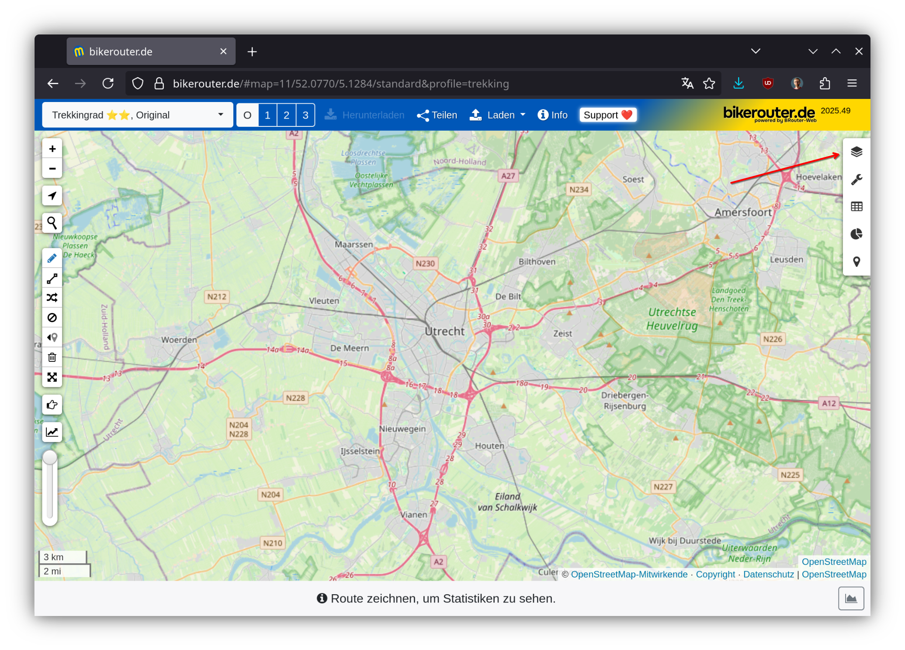
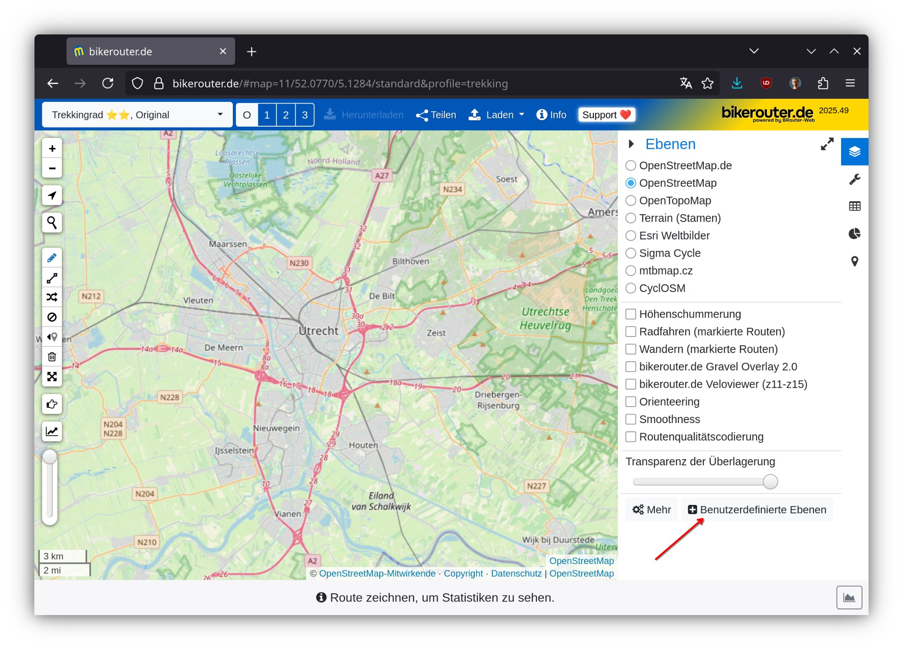
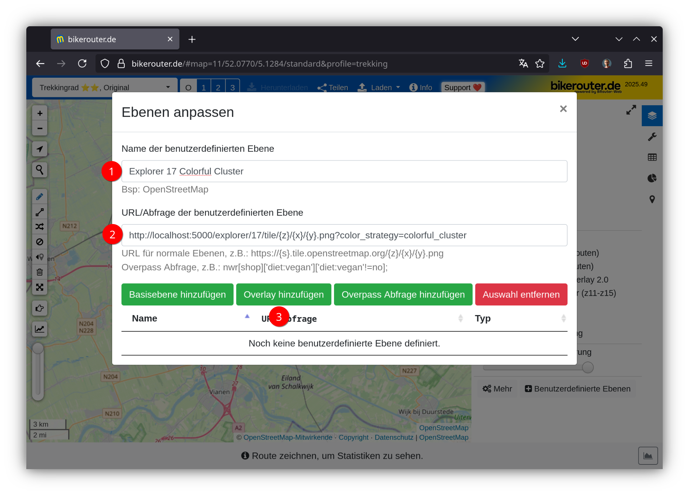
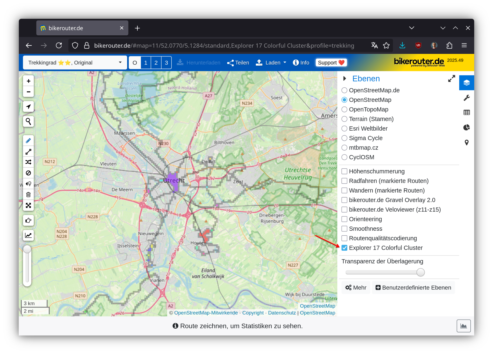

# Using Maps as Overlays

You can use the explorer tile maps and the heatmap as overlays elsewhere. For that, use the following URLs:

For the base layers, you can use these URLs:

```
http://localhost:5000/tile/grayscale/{z}/{x}/{y}.png
http://localhost:5000/tile/pastel/{z}/{x}/{y}.png
http://localhost:5000/tile/color/{z}/{x}/{y}.png
http://localhost:5000/tile/inverse_grayscale/{z}/{x}/{y}.png
```

For the explorer tiles, you can use these:

```
http://localhost:5000/explorer/14/tile/{z}/{x}/{y}.png?color_strategy=colorful_cluster
http://localhost:5000/explorer/14/tile/{z}/{x}/{y}.png?color_strategy=max_cluster
http://localhost:5000/explorer/14/tile/{z}/{x}/{y}.png?color_strategy=first
http://localhost:5000/explorer/14/tile/{z}/{x}/{y}.png?color_strategy=last
http://localhost:5000/explorer/14/tile/{z}/{x}/{y}.png?color_strategy=visits
http://localhost:5000/explorer/14/tile/{z}/{x}/{y}.png?color_strategy=missing

http://localhost:5000/explorer/17/tile/{z}/{x}/{y}.png?color_strategy=colorful_cluster
http://localhost:5000/explorer/17/tile/{z}/{x}/{y}.png?color_strategy=max_cluster
http://localhost:5000/explorer/17/tile/{z}/{x}/{y}.png?color_strategy=first
http://localhost:5000/explorer/17/tile/{z}/{x}/{y}.png?color_strategy=last
http://localhost:5000/explorer/17/tile/{z}/{x}/{y}.png?color_strategy=visits
http://localhost:5000/explorer/17/tile/{z}/{x}/{y}.png?color_strategy=missing
```

And for the heatmap, you can use these:

```
http://localhost:5000/heatmap/tile/{z}/{x}/{y}.png
```

## Adding them to Bikerouter

Go to [Bikerouter](https://bikerouter.de) and then you can add these as overlay layers. I show it here with the explorer tiles on zoom 17 with the "colorful cluster" strategy:









And now you can plan routes with your explorer tiles overlaid. Or add the heatmap. Or both.

## Style JSON endpoint for MapLibre GL clients

For applications that consume a [MapLibre GL style document](https://maplibre.org/maplibre-style-spec/) rather than a plain tile URL (e.g. [Wanderer](https://wanderer.to/)), GAP can generate one on the fly:

```
http://localhost:5000/explorer/{zoom}/style.json?color_strategy={strategy}
```

If `map_style_url` is set in `config.json`, that style is fetched and extended with a `gap-explorer-{zoom}-{strategy}` source and matching raster layer. Otherwise a minimal raster style is generated using the configured `map_tile_url` as the base layer. Both the style and the underlying explorer tile endpoints send `Access-Control-Allow-Origin: *`, so external browser-based map applications can fetch them directly.

## Maps and Layers on-the-go

You might concider using a VPN to get the latest version of your missing explorer tiles when you are on-the-go. One example is [Using Docker Compose with Tailscale VPN](using-docker-compose-and-tailscale-vpn.md).  